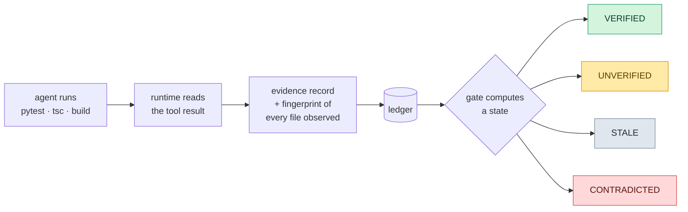
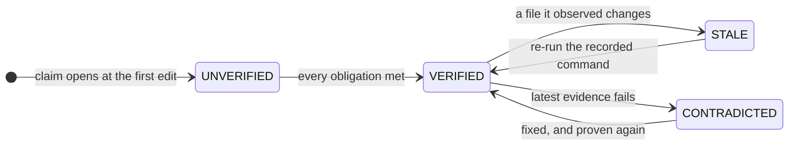

<div align="center">

# ElevenPowers

### Your coding agent says it's done.<br/>This asks for the receipts.

[](docs/research/licenses.md)
[](https://www.python.org/)
[](https://claude.com/claude-code)
[](tests/)
[](#where-this-actually-is)

**[The idea](#the-thirty-second-version)** · **[The survey](#first-i-went-and-read-the-competition)** · **[What's different](#whats-different-here)** · **[Install](#install)** · **[Status](#where-this-actually-is)** · **[Credit](#standing-on-fourteen-sets-of-shoulders)** · **[The journey](#this-is-a-work-in-progress-and-says-so-on-purpose)**

**[The Guide](the-guide/)** — install, commands, configuration, troubleshooting  ·  **[What's Offered](whats-offered/)** — features, roadmap, how it compares

</div>

---

> **What this is.** A completion gate for coding agents.
> It watches the commands your agent already runs, turns their output into **evidence**, and binds each record to the exact bytes of the files it observed.
> When the agent claims it's done, a state gets **computed** instead of believed.
> Edit a file afterwards and its green tests go **stale** — the way `make` invalidates an object file.

---

<div align="center">

### *The path is ours to walk.*<br/>*Where it ends was never ours to choose.*

**So walk it honestly — and keep the receipts.**

</div>

---

## The thirty-second version

Ask a coding agent to fix a bug and it will tell you the bug is fixed.

It is telling the truth as it understands it. That is the problem. Published measurements put the gap between *claiming* completion and *achieving* it in the tens of percent — one study found a frontier model that submitted a patch on every single run and resolved 44% of them. Prompting the model to be more careful does not close that gap, because the model was never lying. It simply has no way to know.

So stop asking it.

Every agent already runs commands. Tests, typechecks, builds, the failing reproduction it wrote three minutes ago. All of that output is flowing past unread on its way to the scrollback. ElevenPowers reads it, files it as evidence, and stamps each record with a fingerprint of the files it saw.



Then "done" stops being a sentence the model emits and becomes a state you can compute:

```
UNVERIFIED  bug_fixed
  missing  a test covering the change passes
           run the test that exercises this change, by name or by file
  missing  that test failed before the fix
           run it before applying the fix so the failure is on record
  met      the related test suite passes
```

And because each record is bound to file content, evidence rots when the code moves under it:

```
STALE  bug_fixed
  stale    a test covering the change passes
           recorded at tree fb7fb4ae5570c0da, files have changed since
           re-run: python -m pytest tests/test_core.py -q
```

The closest analogue is not another agent framework. It is `make`.

| State | Meaning |
|---|---|
| `VERIFIED` | every obligation met by fresh evidence |
| `UNVERIFIED` | an obligation has no evidence |
| `STALE` | evidence exists, but the files it observed have changed |
| `CONTRADICTED` | the latest evidence for something is failing |

A claim moves between them on its own, as the code moves:



> [!NOTE]
> A failure that was later fixed is *reproduction evidence*, not a contradiction — that's the point of demanding the test failed first. Only the most recent record per identity counts.

---

## First, I went and read the competition

Before writing a line of runtime, I cloned fourteen agent systems, pinned each to a commit, and read them from source. Not the READMEs — the source. Where the loop exits. What is actually *enforced in code* versus what is merely *requested in a prompt*. Where each one is genuinely brilliant, and where it quietly gives up.

> [!NOTE]
> **62,608 words of notes. 2,646 lines of runtime.** A reading-to-writing ratio of roughly 24:1, which felt indulgent right up until the fourth system turned out to have the same blind spot as the first three.

Every card is in [`docs/research/cards/`](docs/research/cards/) with `file:line` citations at a recorded commit, and anything *inferred* rather than read is marked as inferred.

| | Where it's genuinely great | Where it stops |
|---|---|---|
| **Aider** | the best repository map in the field — tree-sitter tags, a symbol graph, personalized PageRank, budgeted render | tests are off by default |
| **Continue** | a real index: FTS5 trigrams, embeddings, collapsed-AST chunks, incremental | done = the loop ended |
| **Cline** | checkpoints that survive anything — three-parent stashes in private refs | no verification mechanism at all |
| **OpenCode** | the message list *is* the state machine; resume, fork and revert fall out for free | done = finish reason |
| **OpenHands** | append-only event log, condensers, resumes cleanly after anything | done = the model stopped |
| **SWE-agent** | full queryable trajectories, revert-on-lint | the patch *is* the deliverable |
| **mini** | 190 lines, one `bash` tool, and a score that embarrasses scaffolds ten times its size | that's rather the point |
| **Agentless** | no agent at all — 40 candidate patches, execution-based selection, majority vote | hard-wired to one benchmark, one language |
| **AutoCodeRover** | an AST-aware search API a model can actually aim | not open source; ideas only |
| **gstack** | evidence bound to a working-tree hash — the closest thing to a contract anyone ships | exactly one declared command |
| **Superpowers** | real discipline: TDD, file handoff, a ledger that survives compaction | enforced by prose — its own `CLAUDE.md` admits agents ignore the rules |
| **ECC** | hooks that fire whether or not the model cooperates; a shell classifier that catches `sh -c` bypasses | 21–23k tokens loaded before you've typed anything |
| **Spec Kit** | one template source rendered to 41 hosts; exit-code prerequisite gates | a completion checklist it ticks itself |
| **BMAD** | blind review — reviewers see the diff and never the author's story | prose, plus a finding floor that guarantees noise on tiny diffs |

### The pattern that made this project exist

Read fourteen of these in a row and the same shape shows up in every one:

> [!IMPORTANT]
> ### "Done" means the model said so, or the model stopped.

One of the fourteen binds a single declared command to a tree hash. **None computes completion from evidence.** None ships tooling for intermittent bugs. Nine of ten enforce their process through text the model is free to ignore — and three admit it in their own repositories.

That is not a knock on any of them. Every one is better engineered than this project, most are years older, and I borrowed from all of them. They were simply solving the turn *before* this one.

---

## What's different here

#### Evidence is collected, not demanded

No new ceremony, no protocol for the agent to follow, no sentinel lines to emit. It runs its tests the way it always did; the runtime reads the output. If the agent never cooperates once, the evidence is still there.

#### Evidence expires

Every record carries a fingerprint of what it observed. Change those files and the record goes `STALE`, with the exact command to re-run. This is the whole idea, and it is borrowed shamelessly from Test Impact Analysis — which has tracked test-to-source dependencies in industry for years — pointed at agent completion instead of test selection.

#### Obligations scale with risk, and arrive early

Touching `auth/`, `payments/`, migrations, infra or secrets costs more proof than touching a README. And they are announced at the *first edit*, while the agent can still act on them, rather than sprung at the end as an ambush:

```
this task will need, before it can be called done:
  a test covering the change passes
    run the test that exercises this change, by name or by file
  the related test suite passes
    run the suite covering the files you changed, not just the one test
  repeated runs show the failure is gone
    ep-repeat 20 -- <the command that reproduced it>
```

#### `cannot_complete` is a first-class outcome

A system with no way to say *"this should not be done as asked"* has quietly reproduced the action bias that causes false completion in the first place.

#### Intermittent bugs get arithmetic instead of vibes

The one case where a single green run proves nothing. Ask about something flaky and the runtime computes how many clean runs are actually enough, from the failure rate the agent itself measured:

```
missing  repeated runs show the failure is gone
         ep-repeat 29 -- python -m pytest tests/test_worker.py -q
         so far: still failed 3 of 30
```

Three failures in thirty is a 10% rate; ruling that out at 95% confidence needs 29 clean runs, because 0.9²⁹ < 0.05. The agent is handed the number rather than left to invent one. The runner stands alone, too:

```bash
ep-repeat 50 --jobs 8 -- pytest tests/test_login.py   # is this flaky, and how flaky
```

None of the fourteen ships anything like it.

#### The seam is tested, not assumed

A verification layer that silently stops working is worse than none — and this is not hypothetical: three defects in the layer between this runtime and its host each failed *by doing nothing*, while every unit test stayed green. So `ep-doctor` feeds the runtime a tool result shaped exactly the way the host shapes one, and checks the answer comes back right:

```
ok    python 3.13.2
ok    a failing command is recorded as failing
ok    a passing command is recorded as passing
ok    hooks.json subscribes to every event the runtime handles (6 tools recorded)
ok    the ledger directory is writable
ok    nothing unreadable has arrived from the host
```

Anything it cannot parse lands in `.elevenpowers/blindspots.jsonl` — so a host that renames a field becomes a diagnosable symptom instead of a tool that quietly went quiet.

#### It stays inside the task

Agents wander. When an edit lands somewhere the task has neither read nor been asked about, the guard *asks* — it never denies, because you are the judge:

```
src/billing/stripe.py is in billing, which this task has not read or edited,
and the request does not mention it. Edit it anyway, or read it first.
```

Scope is never declared up front, because nobody knows which files a change will touch before making it. It is derived from what the task established: files read, files edited, and the areas the request named.

---

## Install

```bash
git clone https://github.com/SatyamSingh-Git/ElevenPowers.git
claude --plugin-dir ElevenPowers/plugin
```

Nothing to configure. Ask for a change the way you normally would.

```bash
python plugin/bin/ep_doctor.py    # is the runtime seeing what the host sends?
python plugin/bin/ep_status.py    # what do I still owe on this task?
```

> [!TIP]
> Full instructions, every command and flag, and what to do when something breaks: **[The Guide](the-guide/)**. Run `ep_doctor.py --host` once after installing — the shallower check passed for weeks while silently discarding the flag.

Optionally, in `.elevenpowers/config.json` — a project with no config behaves exactly as it did before:

```json
{
  "profile": "strict",
  "commands": {"tests": "make test", "typecheck": "npm run typecheck"}
}
```

| Profile | Behaviour |
|---|---|
| `off` | record evidence, say nothing, never block |
| `guide` | say what would prove the work, report at the end, never block |
| `strict` | all of the above, and refuse to stop while obligations are unmet |

> [!TIP]
> Declaring your commands is the single highest-value line of config. It tells the runtime this project *has* a suite even when the suite hides behind a Makefile, it replaces a guessed hint with the command you actually use, and it lets the runtime discharge obligations **by running them itself** instead of interrupting to demand them. That one change took live blocking from 75% of runs to 12%.

---

## What claims cost

Claims are inferred from the request by pattern matching — no model call, no added latency. Ask a question or request a code read and no claim opens at all; the runtime stays entirely out of the way.

Most requests state no claim, because one real prompt in five is four words or fewer and "continue" carries its subject in the conversation rather than in the message. So the claim follows the work: the first edit to a source file opens one. Measured across **3,557 turns of real sessions**, obligations attach to 21% of turns that changed nothing — down from 51% under the naive rule.

| Claim | Low risk | High risk adds |
|---|---|---|
| `bug_fixed` | covering test passes, suite green | prior failure on record, stability over repeated runs |
| `feature_added` | suite green | covering test, typecheck, build |
| `refactor_safe` | suite green | typecheck, build |
| `migration_safe` | applies and reverts | suite green, stability |
| `perf_improved` | benchmark | suite green, stability |
| `deps_updated` | suite green | build, typecheck |
| `docs_changed` | nothing | nothing |
| `cannot_complete` | a reason and what was tried | evidence the blocker is real |

---

## Where this actually is

Week one. Here is the unflattering version, because the alternative is becoming the thing this project was built to catch.

Every figure below was produced by the command printed next to it.

| What was measured | Result | Reproduce with |
|---|---|---|
| Reading real tool results | **174/174** failures, **5,916/5,916** successes, over 36,034 commands | `python -m eval.replay --all` |
| The gate as a classifier | 0% false blocks, 0% misses on 46 scenarios | `python -m eval.run --all` |
| The scope guard | 0 false questions, 0 misses on 25 cases | `python -m eval.scope_run` |
| Claim inference, real turns | 21% over-claim, 25% missed work, across 3,557 turns | `python -m eval.claims_run` |
| Live blocking | **12% of runs, down from 75%** | `python -m eval.live --arm gate --model haiku` |
| Host integration | six checks | `python plugin/bin/ep_doctor.py` |
| Audit probes | **every reproduced defect fixed**, zero xfails; R2 narrowed rather than closed | `python -m pytest tests/test_audit_probes.py -q` |
| A pinned baseline | 68.9 and 73.3 across two passes of ninety paid runs, $67.42 | `python -m eval.baseline --pinned` |
| **Does the work come out better?** | **unanswered — one arm was measured, not two** | `python -m eval.noise a.json b.json` |

**On the first row.** Claude Code writes a transcript of every session including each tool result exactly as the host produced it, so replaying those costs no inference and needs no hand labelling — the host already recorded whether each command failed. The reader this replaced agreed on 0 of 174 failures. It is reported as two rates rather than one because the corpus is 97% successes: a reader that answers "passed" to everything scores 97% accuracy while being wrong about the only thing the gate needs to know.

**On the last row.** It runs live — 89 free runs through the CLI where the gate fires, refuses the stop and the agent goes back to work, and since then ninety paid ones against a pinned corpus and a pinned model. What none of that has shown is whether the output is *better*, because the paid sweep measured one arm rather than two. Two identical plain passes over the same sixteen tasks resolved eleven and fifteen.

That night also contradicted something the harness assumed twice over: the grade turned out to be a function of the grader's Git configuration, and then of what an unrelated agent installed on the machine mid-run. Three claims from the write-up were withdrawn afterwards. [23-spend.md](journey/23-spend.md) has it, including the part where the verification that should have prevented a bad measurement looked exactly like success.

Answering it honestly needs **31 pairs on which the two arms disagree**, against a task suite rebuilt so most of it actually discriminates. This page used to say 252 agent runs; that figure is withdrawn. It came from dividing the required pairs by the within-arm flip rate, and flipping is not disagreement — a baseline that fails every time against a treatment that succeeds every time flips never and disagrees always. Converting pairs into runs needs a measured rate of disagreement, and no run here has produced one.

> [!WARNING]
> **An external audit found sixteen defects** in the runtime and the evaluator. Rather than quietly fixing the embarrassing ones, each became a test that fails on purpose until it doesn't — so `tests/test_audit_probes.py` is the authority here, not this README. A defect marked `xfail(strict=True)` that starts passing *fails the run*, which forces the marker off and makes it impossible to fix something quietly.
>
> All sixteen now pass. Four of those probes could not detect the repair of the defect they recorded, and the largest defect found in the process was not in the audit at all: the fingerprint that decides whether evidence is stale could not see a same-length edit, in 220 of 300 attempts. [18-evidence.md](journey/18-evidence.md) has it.
>
> The worst one deserves naming out loud: **the task grader ran only the fail-to-pass set**, so a patch that broke existing tests scored as *resolved* — on a measurement whose entire subject is catching exactly that. Fixed 2026-09-12. Every number published before that date deserves the appropriate suspicion.

**Not built yet:** no workflow engine, no repository index, no memory, no model routing, no subagents. Each is postponed with a written trigger in [`docs/postponed.md`](docs/postponed.md). Invalidation is coarse — any source edit stales everything — and narrowing it to each test's import closure is the documented next step, but only once measurement shows the coarse version is too pessimistic to live with.

---

## Standing on fourteen sets of shoulders

Nothing here was invented from nothing, and pretending otherwise would be both dishonest and a waste of fourteen excellent codebases.

The method was deliberate: read each system from source, separate what it enforces in **code** from what it merely requests in **prose**, inventory every strength and every weakness, then map which system's strength covers which other system's weakness. Whatever remained uncovered by all fourteen — *that* was the only honest place to build something new. The full mapping is in [`complementarity-matrix.md`](docs/research/complementarity-matrix.md). It found ten residual gaps; this runtime attacks three of them.

What came from where:

| Borrowed from | What was taken |
|---|---|
| **gstack** | evidence fingerprinted against a working tree, and a Stop hook that can refuse. The nearest prior art to this whole project — a starting point, not a competitor |
| **Aider** | how a repository map should be built, and what a reproducible benchmark harness looks like |
| **BMAD** | blind-then-claims review ordering, and provenance rules for admitting evidence at all |
| **ECC** | a hook runtime that fails open, writes atomically, and survives its own errors |
| **Spec Kit** | exit-code prerequisites, and one template source rendered to many hosts |
| **Superpowers** | an append-only ledger as the answer to compaction, and testing a *skill* against a baseline that lacks it |
| **OpenCode · Cline · OpenHands** | state you can resume, fork and revert |
| **SWE-agent · mini** | trajectories worth querying, and a 190-line reminder that the floor is far higher than the marketing suggests |
| **Agentless · AutoCodeRover** | generate many candidates, then *select* by execution rather than by vibe |
| **Test Impact Analysis** | dependency-tracked invalidation — ordinary industry practice, and the mechanism at the centre of this |
| **Proof-or-Stop** (arXiv 2607.14890) | found *after* the design was settled, and closer to this thesis than anything in the fourteen. Cited rather than buried |

Licenses, commits, copyright holders and reuse obligations for all of it: [`docs/research/licenses.md`](docs/research/licenses.md). Where a system's terms forbid reuse, only the *idea* was taken, and it says so.

And yes — this was built with coding agents, mostly Claude and Codex. A project about whether agent output can be trusted would be a strange place to get coy about that. The evidence layer was pointed at its own construction from day one, and [`docs/dogfood-log.md`](docs/dogfood-log.md) records where it caught its own author. The sixteen-defect audit above is what happened when someone else's agent was pointed at it too.

---

## Reading further

| | |
|---|---|
| [`PLAN.md`](PLAN.md) | the thesis, the architecture, the hypotheses under test, and honest bounds on what is new |
| [`docs/research/`](docs/research/) | fourteen systems read from source, every claim cited to a file at a recorded commit |
| [`competitor-map.md`](docs/research/competitor-map.md) | ten systems × thirteen architectural axes, on one screen |
| [`docs/postponed.md`](docs/postponed.md) | what is not built, and the trigger that would start it |
| [`the-guide/`](the-guide/) | install, commands, configuration, troubleshooting — the practical manual |
| [`whats-offered/`](whats-offered/) | features as they stand, the five-phase roadmap, and an honest comparison |

---

## This is a work in progress, and says so on purpose

Everything above is a snapshot. The thesis has already been demoted once, the objective rewritten once, and a published result withdrawn once — and the questions still open in `PLAN.md` §7 guarantee more of that is coming. Numbers here will be superseded. Sections will be rewritten. Some of what this README currently argues will turn out to be wrong, and when it does, it gets corrected rather than quietly dropped.

**So if you want the real story, don't read this file — read [`journey/`](journey/).**

It is the complete record, written so that someone who was not here can reconstruct the reasoning, including the parts that were mistaken. Twenty-four chapters, in order:

- **Where it started** — [the original brief](journey/01-origins.md), the first plan written from memory, and why that was exactly the wrong way to begin.
- **What was read** — [fourteen systems from source](journey/02-research.md): the method, what each one actually turned out to be, and the findings that overturned the assumptions I walked in with.
- **How the design changed** — [two rewrites and the pivot](journey/03-architecture.md), from classifying tasks to deriving proof obligations.
- **What building it taught** — [the first working version](journey/04-build.md) and the three defects that only surfaced in use; [a guard that shipped as dead code](journey/07-scope.md), twice; [three more defects](journey/08-wiring.md) in the one layer nobody had measured, found by reading 36,000 real commands.
- **What measurement destroyed** — [75% false blocks](journey/05-measurement.md) and every fix; [89 live runs](journey/10-live.md) where the mechanism works and the measurement doesn't; [twelve real bugs](journey/14-null.md) where the gate changed nothing at all and the obvious fix turned out to be theatre; [an external critique](journey/15-correction.md) that dismantled a conclusion I had just reached.
- **Where it is now** — [sixteen reproduced defects](journey/16-audit.md), a grader blind to the exact regressions it existed to catch, a change of objective, then [the evaluator](journey/17-preservation.md), [the evidence layer](journey/18-evidence.md) and [the host contract](journey/19-host.md) repaired; [Phase A closed](journey/20-reconstructible.md); [a corpus](journey/21-corpus.md) and [an instrument](journey/22-instrument.md) that refuse to run unpinned; and [the first night allowed to cost money](journey/23-spend.md).
- **Where it's heading** — [`PLAN.md`](PLAN.md) §7, three tracks with explicit prerequisites rather than a chain.

Two files there are worth more than the chapters: [`decisions.md`](journey/decisions.md), every significant decision with its reasoning and whether it still stands — and [`mistakes.md`](journey/mistakes.md), every mistake made, kept in full, because the corrections turned out to be the most transferable part of the whole thing.

Every number quoted anywhere in that folder was produced by a command in this repository, and the command is printed next to it.

---

<div align="center">

**Apache-2.0** · Built on the work of fourteen better-established projects, with attribution for every one.

*If you maintain one of them and I have misread your code — open an issue.<br/>The card is pinned to a commit, and I would much rather be corrected than cited wrongly.*

</div>
