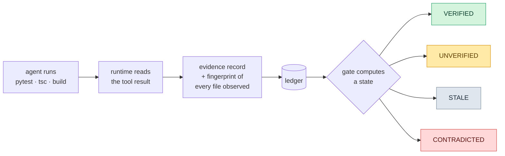
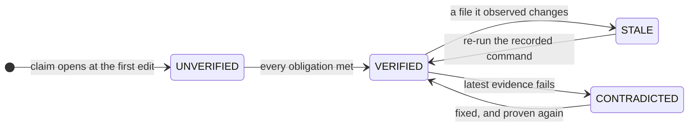

<div align="center" markdown="1">

# ElevenPowers

### Your coding agent says it's done.<br/>This asks for the receipts.

[](docs/research/licenses.md)
[](https://www.python.org/)
[](the-guide/platforms.md)
[](https://github.com/SatyamSingh-Git/ElevenPowers/actions/workflows/tests.yml)
[](#where-this-actually-is)
[](https://satyamsingh-git.github.io/ElevenPowers/architecture/)

**[The idea](#the-thirty-second-version)** · **[The survey](#first-i-went-and-read-the-competition)** · **[What's different](#whats-different-here)** · **[In your project](#using-elevenpowers-in-your-project)** · **[Install](#install)** · **[Status](#where-this-actually-is)** · **[Credit](#standing-on-fourteen-sets-of-shoulders)** · **[The journey](#this-is-a-work-in-progress-and-says-so-on-purpose)**

**[🗺️ Open the live architecture graph](https://satyamsingh-git.github.io/ElevenPowers/architecture/)** — five views, including a [contributor roadmap](https://satyamsingh-git.github.io/ElevenPowers/architecture/#planned)

</div>

---

> **What this is.** An evidence and verification layer for coding agents, with change-impact analysis and project health checks.
> It watches the commands your agent already runs, turns their output into **evidence**, and binds each record to the exact bytes of the files it observed.
> It helps identify what a change may affect, keeps earlier behavior checks visible across tasks, and **computes a verification state** when the agent claims it's done.
> Edit an observed file afterwards and its green tests go **stale** — the way `make` invalidates an object file. Missing, failing and incomplete evidence stays explicit; choose reporting or completion gating through the project profile.

**What it can do today:**

1. **ImpactGraph:** possible consumers, candidate tests and explained dependency paths.
2. **Milestone verification:** earlier behavior checks and their evidence across tasks, with optional recheck advice.
3. **Test strength:** optional mutation analysis that identifies possible test gaps.
4. **Project readiness and health:** command discovery, repository-aware scanning and integration health.
5. **Resumable verification:** saved progress, fresh-result reuse and qualified passing checkpoints.
6. **Evidence reports:** reviewer-readable Markdown and JSON exports.
7. **Five host integrations:** Claude Code, Codex, Gemini CLI, Cursor Agent and GitHub Copilot CLI.

---

<div align="center" markdown="1">

### *The path is ours to walk.*<br/>*Where it ends was never ours to choose.*

**So walk it honestly — and keep the receipts.**

</div>

---

## The thirty-second version

Ask a coding agent to fix a bug and it will tell you the bug is fixed.

It is telling the truth as it understands it. That is the problem. Published measurements put the gap between *claiming* completion and *achieving* it in the tens of percent — one study found a frontier model that submitted a patch on every single run and resolved 44% of them. Prompting the model to be more careful does not close that gap, because the model was never lying. It simply has no way to know.

So stop asking it.

Every agent already runs commands. Tests, typechecks, builds, the failing reproduction it wrote three minutes ago. All of that output is flowing past unread on its way to the scrollback. ElevenPowers reads it, files it as evidence, and stamps each record with a fingerprint of the files it saw.


```mermaid
flowchart LR
    A["agent runs<br/>pytest · tsc · build"] --> B["runtime reads<br/>the tool result"]
    B --> C["evidence record<br/>+ fingerprint of<br/>every file observed"]
    C --> D[("ledger")]
    D --> E{"gate computes<br/>a state"}
    E --> V["VERIFIED"]
    E --> U["UNVERIFIED"]
    E --> S["STALE"]
    E --> X["CONTRADICTED"]

    classDef ok fill:#d4f4dd,stroke:#22a06b,color:#0b3d2c
    classDef warn fill:#ffeaa7,stroke:#d98e04,color:#5c3c00
    classDef stale fill:#dfe6ee,stroke:#7b8a9b,color:#1f2d3a
    classDef bad fill:#ffd9d9,stroke:#d64545,color:#5c1111
    class V ok
    class U warn
    class S stale
    class X bad
```

Then "done" stops being a sentence the model emits and becomes a state you can compute:

```
UNVERIFIED  bug_fixed
  missing  a test covering the change passes
           run the test that exercises this change, by name or by file
  missing  that test failed before the fix
           run it before applying the fix so the failure is on record
  met      the related test suite passes
```

And because each record is bound to file content, evidence rots when the code moves under it:

```
STALE  bug_fixed
  stale    a test covering the change passes
           recorded at tree fb7fb4ae5570c0da, files have changed since
           re-run: python -m pytest tests/test_core.py -q
```

The closest analogue is not another agent framework. It is `make`.

| State | Meaning |
|---|---|
| `VERIFIED` | every obligation met by fresh evidence |
| `UNVERIFIED` | an obligation has no evidence |
| `STALE` | evidence exists, but the files it observed have changed |
| `CONTRADICTED` | the latest evidence for something is failing |

A claim moves between them on its own, as the code moves:


```mermaid
stateDiagram-v2
    direction LR
    [*] --> UNVERIFIED: claim opens at the first edit
    UNVERIFIED --> VERIFIED: every obligation met
    VERIFIED --> STALE: a file it observed changes
    STALE --> VERIFIED: re-run the recorded command
    VERIFIED --> CONTRADICTED: latest evidence fails
    CONTRADICTED --> VERIFIED: fixed, and proven again
```

> [!NOTE]
> A failure that was later fixed is *reproduction evidence*, not a contradiction — that's the point of demanding the test failed first. Only the most recent record per identity counts.

---

## First, I went and read the competition

Before writing a line of runtime, I cloned fourteen agent systems, pinned each to a commit, and read them from source. Not the READMEs — the source. Where the loop exits. What is actually *enforced in code* versus what is merely *requested in a prompt*. Where each one is genuinely brilliant, and where it quietly gives up.

> [!NOTE]
> **62,608 words of notes. 2,646 lines of runtime.** A reading-to-writing ratio of roughly 24:1, which felt indulgent right up until the fourth system turned out to have the same blind spot as the first three.

Every card is in [`docs/research/cards/`](docs/research/cards/) with `file:line` citations at a recorded commit, and anything *inferred* rather than read is marked as inferred.

| | Where it's genuinely great | Where it stops |
|---|---|---|
| **Aider** | the best repository map in the field — tree-sitter tags, a symbol graph, personalized PageRank, budgeted render | tests are off by default |
| **Continue** | a real index: FTS5 trigrams, embeddings, collapsed-AST chunks, incremental | done = the loop ended |
| **Cline** | checkpoints that survive anything — three-parent stashes in private refs | no verification mechanism at all |
| **OpenCode** | the message list *is* the state machine; resume, fork and revert fall out for free | done = finish reason |
| **OpenHands** | append-only event log, condensers, resumes cleanly after anything | done = the model stopped |
| **SWE-agent** | full queryable trajectories, revert-on-lint | the patch *is* the deliverable |
| **mini** | 190 lines, one `bash` tool, and a score that embarrasses scaffolds ten times its size | that's rather the point |
| **Agentless** | no agent at all — 40 candidate patches, execution-based selection, majority vote | hard-wired to one benchmark, one language |
| **AutoCodeRover** | an AST-aware search API a model can actually aim | not open source; ideas only |
| **gstack** | evidence bound to a working-tree hash — the closest thing to a contract anyone ships | exactly one declared command |
| **Superpowers** | real discipline: TDD, file handoff, a ledger that survives compaction | enforced by prose — its own `CLAUDE.md` admits agents ignore the rules |
| **ECC** | hooks that fire whether or not the model cooperates; a shell classifier that catches `sh -c` bypasses | 21–23k tokens loaded before you've typed anything |
| **Spec Kit** | one template source rendered to 41 hosts; exit-code prerequisite gates | a completion checklist it ticks itself |
| **BMAD** | blind review — reviewers see the diff and never the author's story | prose, plus a finding floor that guarantees noise on tiny diffs |

### The pattern that made this project exist

Read fourteen of these in a row and the same shape shows up in every one:

> [!IMPORTANT]
> ### "Done" means the model said so, or the model stopped.

One of the fourteen binds a single declared command to a tree hash. **None computes completion from evidence.** None ships tooling for intermittent bugs. Nine of ten enforce their process through text the model is free to ignore — and three admit it in their own repositories.

That is not a knock on any of them. Every one is better engineered than this project, most are years older, and I borrowed from all of them. They were simply solving the turn *before* this one.

---

## What's different here

#### Evidence is collected, not demanded

No new ceremony, no protocol for the agent to follow, no sentinel lines to emit. It runs its tests the way it always did; the runtime reads the output. If the agent never cooperates once, the evidence is still there.

#### Evidence expires

Every record carries a fingerprint of what it observed. Change those files and the record goes `STALE`, with the exact command to re-run. This is the whole idea, and it is borrowed shamelessly from Test Impact Analysis — which has tracked test-to-source dependencies in industry for years — pointed at agent completion instead of test selection.

#### Obligations scale with risk, and arrive early

Touching `auth/`, `payments/`, migrations, infra or secrets costs more proof than touching a README. And they are announced at the *first edit*, while the agent can still act on them, rather than sprung at the end as an ambush:

```
this task will need, before it can be called done:
  a test covering the change passes
    run the test that exercises this change, by name or by file
  the related test suite passes
    run the suite covering the files you changed, not just the one test
  repeated runs show the failure is gone
    ep-repeat 20 -- <the command that reproduced it>
```

#### A check that could not have failed is not evidence

Fresh and passing are two facts about a record, and neither is the one that
matters. A test that would have passed *before* your change proves nothing about
it — and measured elsewhere, **46% of agent validation evidence carries no
bug-discriminating information at all**.

**How often does it fire here? Measured 2026-09-17: once in 22 runs.** Across
two sweeps on the same 16 real tasks — sonnet and opus — exactly one check came
back non-discriminating, and it did not replicate when the other model was given
the identical task. The 46% above is somebody else's corpus and it is cited, not
claimed. On this one the effect is rare, and that is written down rather than
left for a reader to discover:
[`results/b4-discriminate/findings.md`](results/b4-discriminate/findings.md).

The runtime can also run relevant configured or discovered checks in a temporary
worktree built from the task's starting commit, after matching passing evidence
exists. If a check already passed there, the report says so. Discovery alone
does not schedule unrelated baseline commands.

```
  ok      the related test suite passes  <- python pytest 1 passed, 0 failed
  could not fail: tests: this check passes without your change, so it is not
                  evidence the change works
```

It reports. It never refuses — naming a weak check costs nothing, and blocking
on one has to earn its cost first.

#### The best state you proved is kept, not overwritten

Published measurements put **60–69% of coding-agent failures** on runs that
reach and edit the *correct* functions and then produce a wrong patch. A long
attempt ends at its latest patch, not its best.

When the declared checks are green, the working tree is committed to a private
ref — your branch, index and stash untouched. If a later edit moves off it, the
report offers it back, and refuses to offer it if `HEAD` has moved underneath,
because restoring then would undo whatever moved it.

#### "It failed before the fix" is computed, not demanded

The obligation used to need the agent to have run the test red *first*. Anyone
who wrote the test afterwards — ordinary practice — could never discharge it,
and an earlier failure from an unrelated typo counted as proof.

Now the question is asked of the repository: **was this test already failing on
the commit this task started from?** If it was and it passes now, that is a
reproduction, whatever order the work happened in. No model call.

#### `cannot_complete` is a first-class outcome

A system with no way to say *"this should not be done as asked"* has quietly reproduced the action bias that causes false completion in the first place.

#### Intermittent bugs get arithmetic instead of vibes

The one case where a single green run proves nothing. Ask about something flaky and the runtime computes how many clean runs are actually enough, from the failure rate the agent itself measured:

```
missing  repeated runs show the failure is gone
         ep-repeat 29 -- python -m pytest tests/test_worker.py -q
         so far: still failed 3 of 30
```

Three failures in thirty is a 10% rate; ruling that out at 95% confidence needs 29 clean runs, because 0.9²⁹ < 0.05. The agent is handed the number rather than left to invent one. The runner stands alone, too:

```bash
ep-repeat 50 --jobs 8 -- pytest tests/test_login.py   # is this flaky, and how flaky
```

None of the fourteen ships anything like it.

#### The seam is tested, not assumed

A verification layer that silently stops working is worse than none — and this is not hypothetical: three defects in the layer between this runtime and its host each failed *by doing nothing*, while every unit test stayed green. So `ep-doctor` feeds the runtime a tool result shaped exactly the way the host shapes one, and checks the answer comes back right:

```
ok    python 3.13.2
ok    a failing command is recorded as failing
ok    a passing command is recorded as passing
ok    hooks.json subscribes to every event the runtime handles (6 tools recorded)
ok    the ledger directory is writable
ok    nothing unreadable has arrived from the host
```

Anything it cannot parse lands in `.elevenpowers/blindspots.jsonl` — so a host that renames a field becomes a diagnosable symptom instead of a tool that quietly went quiet.

#### It stays inside the task

Agents wander. When an edit lands somewhere the task has neither read nor been asked about, the guard *asks* — it never denies, because you are the judge:

```
src/billing/stripe.py is in billing, which this task has not read or edited,
and the request does not mention it. Edit it anyway, or read it first.
```

Scope is never declared up front, because nobody knows which files a change will touch before making it. It is derived from what the task established: files read, files edited, and the areas the request named.

---

## Using ElevenPowers in your project

The same runtime works across projects and coding hosts. It discovers supported
project conventions, preserves existing host configuration, and keeps missing
evidence and incomplete coverage visible. These features build on the completion
gate described above.

### Five host integrations

Project onboarding covers **Claude Code, Codex, Gemini CLI, Cursor Agent and
GitHub Copilot CLI**. Setup preserves other hooks, checks the environment, and
tracks whether native callbacks actually arrive. Native patch observations cover
dirty and non-Git targets while preserving gaps in incomplete histories.

Installation and event delivery differ by host. The four added hosts still
require live installed-session acceptance; launcher checks alone do not establish
it. See [platform installation and limits](the-guide/platforms.md),
[journey 50](journey/50-project-readiness.md), and
[onboarding validation](docs/validation/2026-10-01-live-onboarding.md).

### Repository-aware verification

Loading the plugin automatically checks startup health and discovers verification
commands from supported project manifests. Explicit project configuration can
override discovery for custom commands. Repository scans respect Git ignores
and project boundaries, report incomplete coverage, and support project-owned
file and byte budgets.

Exact declared commands retain **success, failure and incomplete execution** as
distinct receipts. Input fingerprints let later reads distinguish current
evidence from results recorded before the source changed. See
[configuration](the-guide/configuration.md) and
[portable evidence validation](docs/validation/2026-09-28-portable-evidence.md).

### Fresh project health

Check whether the integration is working in a particular project:

```bash
python plugin/bin/ep_ready.py HOST --project PATH --seconds 30
```

The fresh view joins native configuration, startup, edits, command capture and
completion with every declared command's current aggregate outcome and fresh
source evidence. It reports bounded timing samples, optional engine metadata,
coverage gaps and specific next actions. Add `--json` for structured output or
`--check` for an exit-code gate.

The ordinary health read runs no tests, engine or host and writes no project
state. Pipeline health remains separate from task verification. See
[health commands](the-guide/commands.md),
[journey 53](journey/53-a-working-pipeline-needs-evidence.md), and
[health validation](docs/validation/2026-10-01-project-health.md).

### Repeatable native acceptance

Prepare a new disposable project to check an installed host with real failing,
passing and interrupted commands:

```bash
python plugin/bin/ep_doctor.py --prepare-acceptance NEW_DIR --platform HOST --language python --host-version INSTALLED_VERSION
python plugin/bin/ep_doctor.py --acceptance NEW_DIR --platform HOST
```

Run the first command, follow the generated `EXERCISE.md`, then use the second
command to inspect the result. Choose `--language javascript` with Node available
for the JavaScript exercise. The workflow applies to all five hosts and is not
tied to a named project.

Preparation launches no model. Inspection qualifies the retained observations;
replay and launcher fixtures do not establish installed acceptance. See
[acceptance commands](the-guide/commands.md),
[provenance](docs/research/project-health.md), and
[health validation](docs/validation/2026-10-01-project-health.md).

### Versioned native validation and measured costs

`ep_validate.py` captures the existing native exercise, observes installed
versions explicitly, builds a conservative five-host/two-language matrix and
samples read-only project health. Runtime code identity binds preparation and
real startup; changed software and missing histories cannot qualify. Saved
reports are dated local observations. Every attempted latency read remains
visible, with current reads separated from retained callbacks and command time.

The explicit subscription coding pilot freezes equal task/prompt/grader inputs
and compares baseline/tool arms with the requested models at medium. Its first
eight records were inconclusive because execution, native activation and quota
blocked the comparison; they establish no coding improvement. A complete sample
is also not a verified task. See [commands](the-guide/commands.md),
[native observations](docs/validation/2026-10-02-native-validation.md) and
[journey 54](journey/54-a-comparison-needs-a-working-host.md). Recorded-protocol
inspection reproduces earlier saved outcomes without model calls or regrading.

The next controlled comparison ran on a working Claude pipeline with a passive
recorder in both arms. Eight Sonnet 5.5 medium calls produced first and final
candidates passing 16/16 independent checks in every run. Ordinary plugin
completion supplied fresh exact-command receipts in three treatment runs;
final receipt coverage was 4/4 treatment and 1/4 baseline. Wrapped baseline
tests may still have run. This demonstrates additional retained verification
evidence, with no observed patch-correctness improvement. The public archive
reconstructs all 24 proposed/final snapshots without model calls. See
[controlled evidence](docs/validation/2026-10-02-proof-of-benefit.md),
[commands](the-guide/commands.md#controlled-completion-comparison) and
[journey 55](journey/55-at-the-moment-of-done.md).

Four subsequent interacting repairs cover durable leases, async cache races,
dependency invalidation and resumable byte streams with 94 frozen hidden groups.
Seven of eight Sonnet 5 medium subscription slots completed; all complete first
and final candidates passed, and the three complete pairs tied. Three tool
completions added fresh declared receipts. Interrupted cache code retains a
visible-suite timeout and a defect found by a separate shutdown audit. All 22
saved grades reproduce. The comparison remains inconclusive, with no demonstrated
coding improvement or speedup. See
[hard-task results](docs/validation/2026-10-02-hard-task-comparison.md),
[reproduction commands](the-guide/commands.md#controlled-completion-comparison)
and [journey 56](journey/56-harder-problems-still-need-evidence.md).

A fixed-patch review pilot then completed eight Sonnet 5 medium subscription
reviews on ItsDangerous, Click, Jinja2 and attrs, with production and existing
tests fixed. Both ordinary and ElevenPowers-assisted review added tests that
detect five previously missed meaningful Jinja2 faults. All four matched pairs
tied, with greater assisted native review time; this establishes useful tests
from review, **no incremental ElevenPowers quality advantage or speedup**.
Whole-file sampling missed edited functions, and Windows skips qualify Click's
descriptor cases. Every submission and original grade is archived. The separate
corrected-harness regrade completed all twelve sets on 2026-10-03: nine match,
and Click F03 retains mixed failures/setup errors in all three arms. Original
grades remain preserved; Jinja2's equal improvement and the four ties hold.
See [findings](docs/validation/2026-10-02-checkpoint-review.md),
[saved tests and reproduction](docs/validation/2026-10-02-checkpoint-review/README.md)
and [journey 57](journey/57-a-review-needs-a-relevant-lead.md).

```bash
python plugin/bin/ep_validate.py capture HOST --project EXERCISE --observe-version --json
python plugin/bin/ep_validate.py performance HOST --project PATH --repeats 3 --seconds 60 --json
```

Neither command runs project checks or launches a model. Captures qualify native
histories; performance measures reads. Use `--output FILE` to save explicitly
and `--check` to opt into an exit-code gate.

### Portable verification reports

Export a local report a reviewer can read without your coding session:

```bash
python plugin/bin/ep_report.py --project PATH --format markdown --output report.md
```

Markdown and versioned JSON show claims, obligation qualifications, latest
execution receipts, freshly read input fingerprints, coverage gaps and next
actions. Use `--format json` for structured output. Reports exclude prompts,
transcripts, captured outputs and receipt details, scrub known credentials, and
refuse overwrite unless `--force` is supplied. See
[report commands](the-guide/commands.md#ep_report--evidence-to-share-with-a-reviewer),
[journey 51](journey/51-receipts-another-person-can-read.md), and
[report validation](docs/validation/2026-10-01-portable-report.md).

### Explained change impact

ImpactGraph builds a fresh local graph and explains which consumers and tests
may be affected by a file change. Python AST imports and conservative imported
calls, optional JS/TS imports, project-declared contracts and current qualified
observations each retain their provenance. Git co-change stays a separate hint.

```bash
python plugin/bin/ep_impact.py --project PATH src/session.py
```

Queries work without an AI agent, run no project tests and write no project
state. Candidate tests include the path behind the recommendation; ambiguity,
unsupported adapters, stale observations and exhausted budgets remain visible.
The first independent API/worker fixture selected four passing checks, rejected
a seeded boundary fault with two failures, and accepted equivalent behavior.
The real-project extension adds an explicitly selected TypeScript 5.7.3 compiler
for aliases, exports and qualified calls, plus offline coverage.py/Node V8
conversion with source-bound execution receipts. Across 24 frozen cases it found
31/31 known consumers and 23/26 known test references. Actual coverage recovered
one fixture-dependent Jinja test outside that static comparison. Selected checks
caught 5/6 qualified faults in both old and final versions; a process-limit
regression was missed in that earlier comparison. The relevance repair adds
literal Python dynamic imports, test-context pytest fixture paths and specific
focused recommendations alongside retained fallbacks and support files. Across
twelve valid new symbol-query test references, recovery improves from 4/12 to
11/12; six have focused witnesses. A separate corrected machine grade finds
all three authored faults with the repaired selection versus none with the old
selection, including the reused process-limit fault. Original producer grades
and one withdrawn reference remain visible. These are test-selection gains;
automatic advisories and improved agent patch outcomes remain unqualified. See the
[ImpactGraph guide](the-guide/impactgraph.md),
[journey 62](journey/62-a-focused-list-still-needs-its-fallback.md), and
[relevance results](results/impact-relevance/README.md).

### Behavior evidence across development milestones

Impact-enabled inspection now supplies a deduplicated list of exact declared
commands with direct, dependency and fallback priorities. Each retains every
associated milestone's evidence state; ranking never makes stale evidence current
or removes fallback checks. Six authored project controls find 5/6 known required
relationships with no leads to six labelled unrelated references. The subprocess
miss and measured extra read cost stay explicit; this does not establish coding
improvement. See [recheck results](results/milestone-rechecks/README.md).

An optional tracked `elevenpowers.milestones.json` declares earlier behavior
expectations, inputs and exact checks. Matching aggregate receipts survive task
transitions in the existing atomic ledger without supplying evidence for new
task claims. A fresh read-only view distinguishes current, failed, stale,
incomplete and absent checks; portable reports include the section when opted in.

```bash
python plugin/bin/ep_milestones.py --project PATH
python plugin/bin/ep_milestones.py --project PATH --impact --changed src/auth.py
```

Existing capture retains matching receipts automatically; inspection launches no
project check or model. Optional impact paths explain recheck leads without safe
test exclusion or a new completion blocker. Actual three-stage Python and
unrelated Node controls recorded 15 qualified passes and three assertion-fault
rejections across 18 runs. Whole-source receipts still expire after unrelated
edits; narrower scope requires an actual producer observing all declared inputs.
These are capability results, not measured coding improvement. See the
[milestone guide](the-guide/milestones.md),
[journey 63](journey/63-earlier-behavior-needs-current-evidence.md) and
[published observations](results/milestone-verification/README.md).

### Optional test strength

**Changed-region test strength** asks whether passing tests notice small changes to
the production files edited by a task. Cosmic Ray supplies Python mutations;
Stryker supplies JavaScript/TypeScript mutations. Every baseline and attempt
starts from clean private inputs, with explicit time, attempt and copy limits.
Detected changes, possible test gaps, invalid mutations and incomplete execution
appear in the human report with independently checked input freshness.
Selection now uses Git hunks and enclosing functions, partitions broad/new-file
changes, requires full mutation-span containment and rotates bounded samples
across files/functions. Mixed-language shares follow file counts. Reports show
line spans, context and relation to the edit, with explicit qualification that
only the analyzed command was measured. Deleted behavior remains a coverage gap;
available current source can still be examined. Legacy records remain readable
as whole-file samples without invented attribution.

After explicit optional engine setup, `guide` and `strict` completion consider
the shared runner automatically across all five hosts. There is no new completion
blocker and no individual mutant target sent to the coding agent. You can also
run it explicitly:

```bash
python plugin/bin/ep_strength.py --root PATH
```

Export saved findings through `ep_report.py`. Defaults are 60 seconds, eight
attempts and 15 seconds per test command; use a focused command for slower
projects. Missing engines, dirty attribution, editable Python paths into original
source, unsafe dependencies and exhausted budgets stay explicit. Free pinned
upstream controls now reach Jinja2's edited `do_attr` and attrs' `_is_class_var`,
missed by the earlier whole-file sample. This improves analysis relevance;
sampled mutations do not prove correctness or improved patch outcomes. See
[setup and configuration](the-guide/configuration.md),
[engine provenance](docs/research/mutation-engines.md),
[journey 52](journey/52-tests-that-notice-a-change.md), and
[test-strength validation](docs/validation/2026-10-01-test-strength.md),
[current relevance validation](docs/validation/2026-10-03-strength-regions.md)
and [journey 58](journey/58-the-lead-must-belong-to-the-edit.md).

---

## Install

```bash
git clone https://github.com/SatyamSingh-Git/ElevenPowers.git
claude --plugin-dir ElevenPowers/plugin
```

Nothing to configure. Ask for a change the way you normally would.

```bash
python plugin/bin/ep_doctor.py    # is the runtime seeing what the host sends?
python plugin/bin/ep_status.py    # what do I still owe on this task?
```

> [!TIP]
> Full instructions, every command and flag, and what to do when something breaks: **[The Guide](the-guide/)**. Run `ep_doctor.py --host` once after installing — the shallower check passed for weeks while silently discarding the flag.

Optional overrides in `.elevenpowers/config.json`; supported root manifests already supply commands automatically:

```json
{
  "profile": "strict",
  "commands": {"tests": "make test", "typecheck": "npm run typecheck"}
}
```

| Profile | Behaviour |
|---|---|
| `off` | record evidence, say nothing, never block |
| `guide` | say what would prove the work, report at the end, never block |
| `strict` | all of the above, and refuse to stop while obligations are unmet |

> [!TIP]
> Supported manifests now supply verification commands without configuration. Use explicit commands for custom wrappers or to override discovery. Missing checks run at completion in `guide` and `strict`; `off` stays passive. See [automatic setup and overrides](the-guide/configuration.md#automatic-setup-after-loading-the-plugin).

---

## Optional milestone edit advice

Project-owned milestones can now request bounded recheck context automatically
after edits on all five hosts. A separate worker, atomic duplicate reservations,
cooldown and task limits bound work; incomplete coverage and omitted checks stay
visible. Advice runs no tests and adds no completion gate. It is explicit opt-in
pending installed edit-session cost and broader precision. See
[setup and recovery](the-guide/milestones.md#optional-automatic-edit-advice),
[larger-project observations](results/milestone-advisories/README.md) and
[launcher/native measurements](results/milestone-advisories/callbacks.md).

## What claims cost

Claims are inferred from the request by pattern matching — no model call, no added latency. Ask a question or request a code read and no claim opens at all; the runtime stays entirely out of the way.

Most requests state no claim, because one real prompt in five is four words or fewer and "continue" carries its subject in the conversation rather than in the message. So the claim follows the work: the first edit to a source file opens one. Measured across **3,557 turns of real sessions**, obligations attach to 21% of turns that changed nothing — down from 51% under the naive rule.

| Claim | Low risk | High risk adds |
|---|---|---|
| `bug_fixed` | covering test passes, suite green | prior failure on record, stability over repeated runs |
| `feature_added` | suite green | covering test, typecheck, build |
| `refactor_safe` | suite green | typecheck, build |
| `migration_safe` | applies and reverts | suite green, stability |
| `perf_improved` | benchmark | suite green, stability |
| `deps_updated` | suite green | build, typecheck |
| `docs_changed` | nothing | nothing |
| `cannot_complete` | a reason and what was tried | evidence the blocker is real |

---

For a repeatable local test environment, see [Development and verification](docs/development.md).

## Where this actually is

The October 7 explained-recheck delivery adds exact command priorities and
independent authored relationship/cost controls. Its 36 actual checks yield 30
passes and six assertion-fault rejections; the subprocess relationship remains
missed and retained as fallback. See [recheck validation](docs/validation/2026-10-07-milestone-rechecks.md).

The October 6 milestone-verification delivery passed **1,694 local tests with
2 skips**, the host doctor and all four independent grader controls. All five
architecture views render at 126 nodes / 289 edges. The local behavior-retention
capability is delivered; precise native attribution, automatic completion
integration and end-to-end coding benefit remain open. See
[delivery validation](docs/validation/2026-10-06-milestones.md).

The October 2 native-validation delivery passed **1,237 local tests with 28 skips**,
104 audit probes, all four grader controls and the launcher doctor. Five
Important evaluator/export findings were reproduced and corrected. Architecture's
four tabs render with 102 nodes and 232 edges. This delivery has twenty-nine
incremental publication boundaries with descriptive commit messages. See the
[delivery checks](docs/validation/2026-10-02-native-validation-delivery.md).

Installed-host acceptance remains **0/10**, and all eight original subscription
comparison records remain **inconclusive**. A trusted Codex fixture had corrected
source and real failing/passing checks but no plugin callbacks. Later controlled
completion runs have working native Claude delivery and added receipts, and the
fixed-patch review pilot improves Jinja2 test sensitivity equally in both arms.
No incremental coding benefit has been measured. The free regrade and generalized
changed-region/command qualification milestone are now delivered. The next proof
step is a held-out active behavioral-gap comparison against equally funded
ordinary review, with independent checks and retained adverse outcomes. The
resumed delivery launched no extra model sessions.
Task size is not a criterion; an observable coding or verification improvement
through any engaged mechanism can count.

Research prototype; status reviewed 2026-10-07. Optional milestone declarations, atomic cross-task history, read-only qualified views and explained exact-command recheck priorities are delivered; bounded automatic edit advice is now project opt-in; installed advice acceptance and end-to-end coding benefit remain open. ImpactGraph now ships explicit fresh CLI/API queries with explained paths and candidate tests; broader precision and automatic hook acceptance remain open. Repository evidence, exact receipts, five-host onboarding, callback activation, durable completion execution and portable Markdown/JSON reports are shipped. Native patches use bounded target content comparisons; missing/evicted callbacks remain UNVERIFIED. A real Claude Code startup was observed in Snag without a prompt/model call. Its actual external CI passed 14/15 checks and failed the production dependency audit; explicit replay recorded complete/fail, separately from native-host command capture. Its report preserves that failure and does not certify a task with no active claim. The earlier onboarding suite passed 1,062 tests with 28 skips; subsequent delivery checks are recorded separately. Improved patch outcomes have not been demonstrated. See [current status](docs/status.md) and [validation records](docs/validation/README.md).

The optional test-strength delivery passed **1,127 local tests with 28 skips**
after three independent-review fixes. Real Python/JavaScript/TypeScript fixture
acceptance and all four rendered architecture views passed. The implementation
was published in 25 incremental parts; see the [dated record](docs/validation/2026-10-01-test-strength.md)
for exact checks, boundaries and publication subjects.

The September 24 research experiments found real test gaps, but handing raw mutation
lists to agents encouraged tests of implementation details. In 95 resolved patches,
the gate arm had 4/49 vacuous patches versus 10/46 for vanilla; the task-level
comparison was suggestive (p = 0.062), and the primary test-quality comparison
showed no detectable difference. See [B8](results/b8-feedback/findings.md) and
[B9](results/b9-gate-tests/findings.md) for methods and limits.

The known false block is a pre-existing unrelated suite failure: the relevant test
is fixed, but the gate still requires the suite to be green. The table records this
limitation; it has not been fixed by updating the documentation.

Every figure below was produced by the command printed next to it.

| What was measured | Result | Reproduce with |
|---|---|---|
| Reading real tool results | **174/174** failures, **5,916/5,916** successes, over 36,034 commands | `python -m eval.replay --all` |
| The gate as a classifier | **1/28 complete cases falsely blocked (3.6%)**, 0/18 incomplete cases missed; 46 scenarios, rerun 2026-09-27 | `python -m eval.run --all` |
| The scope guard | 0 false questions, 0 misses on 25 cases | `python -m eval.scope_run` |
| Claim inference, real turns | 21% over-claim, 25% missed work, across 3,557 turns | `python -m eval.claims_run` |
| Live blocking | **75% → 12% of runs** after self-discharge landed (16 runs). On the later pinned sweep it was **8% of runs** — six block *events* across four of fifty, which is the figure that matters for sizing an experiment | `python -m eval.live --arm gate --model haiku` |
| Host integration | configuration and callback diagnostics | `python plugin/bin/ep_doctor.py --platform HOST --cwd PATH` |
| Project readiness | fresh native stages, aggregate outcomes, environment, coverage and retained timings | `python plugin/bin/ep_ready.py HOST --project PATH` |
| Native acceptance | explicit new Python/Node exercise and immutable current-observation qualification | `python plugin/bin/ep_doctor.py --prepare-acceptance NEW_DIR --platform HOST` |
| Audit probes | **every reproduced defect fixed**, zero xfails; R2 narrowed rather than closed | `python -m pytest tests/test_audit_probes.py -q` |
| A pinned baseline | 68.9 and 73.3 across two passes of ninety paid runs, $67.42 | `python -m eval.baseline --pinned` |
| Suite records that were wrong | **123 of 295 (42%)** said PASS while holding a failure count — `pytest \| tail` exits with `tail`'s status | `python -m eval.discriminate --bundles results --verbose` |
| Does denying the answer channels work? | **yes, for the network**: upstream retrieval **14 → 0** between the pre- and post-denial sweeps | `python -m eval.canary --corpus <corpus> <bundles>` |
| What survives the denial | the **package registry** and the machine's own `site-packages` — a released version already carrying the fix | same command |
| Is a selector worth building? | **does not settle**: +2.0 to +20.0 across comparable pools, from 1–5 disagreeing tasks each | `python -m eval.pool --from-bundles results/chunks results/bundles-A` |
| **Does the work come out better?** | **no effect measured.** Graded at the moment of the block, the gate fired four times across nineteen runs and changed no outcome; cost is 1.3× vanilla | `python -m eval.checkpoint --grade results/prevalence/bundles --corpus results/prevalence/tasks.json` |
| **Do the three new mechanisms help?** | **unmeasured.** `stress`, `ratchet` and the computed reproduction are unit-tested in both directions and have never run in a sweep | — |

**On the first row.** Claude Code writes a transcript of every session including each tool result exactly as the host produced it, so replaying those costs no inference and needs no hand labelling — the host already recorded whether each command failed. The reader this replaced agreed on 0 of 174 failures. It is reported as two rates rather than one because the corpus is 97% successes: a reader that answers "passed" to everything scores 97% accuracy while being wrong about the only thing the gate needs to know.

**On the coding-outcome row.** It runs live — 89 free runs through the CLI where the gate fires, refuses the stop and the agent goes back to work, then ninety paid runs of one arm against a pinned corpus and model, and then a hundred more with **both** arms. Nineteen of those gated runs have since been graded **at the moment the gate refused**, which nothing here had ever done. The mechanism fired four times and changed no outcome: it blocked a patch that was already correct, one that stayed broken, and one regression that it then failed to catch. Measured cost is 1.3x vanilla; measured benefit is none so far. The fair qualifier is that the case it exists for barely occurs on this corpus, because 80 percent of first proposals are already right.

A literature sweep on 2026-09-15 then explained that null, and re-aimed the plan to
[v0.8](PLAN.md). Independently measured: **46% of agent validation evidence carries no
bug-discriminating information**, and **every model saturates the visible test suite**. So
`PASS` and `FRESH` are two facts about a record and neither is the one that matters — a check
is not evidence until it is shown to *discriminate*. Separately, the **median decisive error
lands at step 7 of 27** steps, which is why a gate at the end changes little. Both fixes were
already written in this repository's own plan and neither had been built. The thesis survives
and is better supported than it has ever been; the *placement* did not.

**And on 2026-09-17 that re-aiming was measured, on the corpus rather than in the
literature — it came back null.** Sixteen tasks on opus, against the same sixteen on
sonnet: **0 of 14** checks were non-discriminating, against 1 of 8 before, and the single
earlier case did not reproduce. So the sentence above needs its qualifier: the 46% is
**cited, not replicated here**, and the claim that agents routinely finish on evidence that
could not have failed is *not* supported by this project's own runs. The mechanism works —
it caught the one case, and it caught a real regression — but a frequency it has not shown
is not a frequency it may assert. The same sweep found something that outranks the rate:
**12.5% of runs bypassed the gate entirely**, because the runtime never observed the agent's
edits. Full numbers and caveats in
[`results/b4-discriminate/findings.md`](results/b4-discriminate/findings.md).

> The rest came out of auditing the sweep afterwards: **24 of the 100 runs name their own task's fix commit**, fetched from GitHub, so the 92 percent is a score for applying a described upstream change with access to that change — not for repairing anything unseen. Whether the output is *better* is still unanswered, and the next thing to build is not a harder corpus but an information boundary. Two identical plain passes over the same sixteen tasks resolved eleven and fifteen.

That night also contradicted something the harness assumed twice over: the grade turned out to be a function of the grader's Git configuration, and then of what an unrelated agent installed on the machine mid-run. Three claims from the write-up were withdrawn afterwards. [23-spend.md](journey/23-spend.md) has it, including the part where the verification that should have prevented a bad measurement looked exactly like success.

Answering it honestly needs **31 pairs on which the two arms disagree**, against a task suite rebuilt so most of it actually discriminates. This page used to say 252 agent runs; that figure is withdrawn. It came from dividing the required pairs by the within-arm flip rate, and flipping is not disagreement — a baseline that fails every time against a treatment that succeeds every time flips never and disagrees always. Converting pairs into runs needs a measured rate of disagreement, and no run here has produced one.

> [!WARNING]
> **An external audit recorded sixteen observations and named fifteen defects** in the runtime and the evaluator — its own appendix says those are “sixteen observations, not sixteen statistically independent findings”, and four more were found here afterwards, so nineteen carry probes. Rather than quietly fixing the embarrassing ones, each became a test that fails on purpose until it doesn't — so `tests/test_audit_probes.py` is the authority here, not this README. A defect marked `xfail(strict=True)` that starts passing *fails the run*, which forces the marker off and makes it impossible to fix something quietly.
>
> All nineteen now pass, eighteen fixed and one narrowed. Four of those probes could not detect the repair of the defect they recorded, and the largest defect found in the process was not in the audit at all: the fingerprint that decides whether evidence is stale could not see a same-length edit, in 220 of 300 attempts. [18-evidence.md](journey/18-evidence.md) has it.
>
> The worst one deserves naming out loud: **the task grader ran only the fail-to-pass set**, so a patch that broke existing tests scored as *resolved* — on a measurement whose entire subject is catching exactly that. Fixed 2026-09-12. Every number published before that date deserves the appropriate suspicion.

**Not built yet:** no workflow engine, no repository index, no memory, no model routing, no subagents. Each is postponed with a written trigger in [`docs/postponed.md`](docs/postponed.md). Invalidation is coarse — any source edit stales everything — and narrowing it to each test's import closure is the documented next step, but only once measurement shows the coarse version is too pessimistic to live with.

---

## Standing on fourteen sets of shoulders

Nothing here was invented from nothing, and pretending otherwise would be both dishonest and a waste of fourteen excellent codebases.

The method was deliberate: read each system from source, separate what it enforces in **code** from what it merely requests in **prose**, inventory every strength and every weakness, then map which system's strength covers which other system's weakness. The full mapping is in [`complementarity-matrix.md`](docs/research/complementarity-matrix.md), and [`build-on.md`](docs/research/build-on.md) does the same for every component currently being built — naming its prior art, licence and limit *before* its design.

> [!IMPORTANT]
> **Originality was never the goal.** An earlier version of this section said the only honest place to build was wherever all fourteen left a gap. That is a novelty filter, and it was retired: a component starts from the best existing implementation, and what we add is stated in one sentence. If that sentence cannot be written, the component is a reimplementation and the borrow wins.

The same applies to research. **Every paper, article, survey, dataset and documentation page that changed a decision here is credited in [`audit_2026_09_15/sources.md`](docs/research/audit_2026_09_15/sources.md)** — 167 links, each with what it contributed and how strongly it was verified, including the ones we relied on and then disagreed with.

What came from where:

| Borrowed from | What was taken |
|---|---|
| **gstack** | evidence fingerprinted against a working tree, and a Stop hook that can refuse. The nearest prior art to this whole project — a starting point, not a competitor |
| **Aider** | how a repository map should be built, and what a reproducible benchmark harness looks like |
| **BMAD** | blind-then-claims review ordering, and provenance rules for admitting evidence at all |
| **ECC** | a hook runtime that fails open, writes atomically, and survives its own errors |
| **Spec Kit** | exit-code prerequisites, and one template source rendered to many hosts |
| **Superpowers** | an append-only ledger as the answer to compaction, and testing a *skill* against a baseline that lacks it |
| **OpenCode · Cline · OpenHands** | state you can resume, fork and revert |
| **SWE-agent · mini** | trajectories worth querying, and a 190-line reminder that the floor is far higher than the marketing suggests |
| **Agentless · AutoCodeRover** | generate many candidates, then *select* by execution rather than by vibe |
| **Test Impact Analysis** | dependency-tracked invalidation — ordinary industry practice, and the mechanism at the centre of this |
| **Proof-or-Stop** (arXiv 2607.14890) | found *after* the design was settled, and closer to this thesis than anything in the fourteen. Cited rather than buried |

Licenses, commits, copyright holders and reuse obligations for all of it: [`docs/research/licenses.md`](docs/research/licenses.md). Where a system's terms forbid reuse, only the *idea* was taken, and it says so.

And yes — this was built with coding agents, mostly Claude and Codex. A project about whether agent output can be trusted would be a strange place to get coy about that. The evidence layer was pointed at its own construction from day one, and [`docs/dogfood-log.md`](docs/dogfood-log.md) records where it caught its own author. The audit above is what happened when someone else's agent was pointed at it too.

---

## Reading further

[Milestone behavior evidence](the-guide/milestones.md) explains project opt-in, exact commands, freshness and scope limits.

| | |
|---|---|
| [`PLAN.md`](PLAN.md) | the thesis, the architecture, the hypotheses under test, and honest bounds on what is new |
| [`docs/research/`](docs/research/) | fourteen systems read from source, every claim cited to a file at a recorded commit |
| [`competitor-map.md`](docs/research/competitor-map.md) | ten systems × thirteen architectural axes, on one screen |
| [`docs/status.md`](docs/status.md) | current delivery state, evidence limits and next integration milestone |
| [`docs/postponed.md`](docs/postponed.md) | what is not built, and the trigger that would start it |
| [`architecture/`](architecture/) | the living graph — 112 nodes, 258 edges, five views and 41 expandable contributor cards; [open it live](https://satyamsingh-git.github.io/ElevenPowers/architecture/) |
| [`the-guide/`](the-guide/) | install, commands, configuration, troubleshooting — the practical manual |
| [`whats-offered/`](whats-offered/) | features as they stand, the five-phase roadmap, and an honest comparison |

---

## This is a work in progress, and says so on purpose

Everything above is a snapshot. The thesis has already been demoted once, the objective rewritten once, and a published result withdrawn once — and the questions still open in `PLAN.md` §7 guarantee more of that is coming. Numbers here will be superseded. Sections will be rewritten. Some of what this README currently argues will turn out to be wrong, and when it does, it gets corrected rather than quietly dropped.

**So if you want the real story, don't read this file — read [`journey/`](journey/).**

It is the complete record, written so that someone who was not here can reconstruct the reasoning, including the parts that were mistaken. The chronological index is in [journey/README.md](journey/README.md). Recent delivery chapters cover [repository evidence](journey/46-the-project-outside-the-fixture.md), [automatic setup](journey/47-installed-should-mean-active.md), [durable verification](journey/48-completed-work-should-survive.md), [five hosts](journey/49-one-engine-several-hosts.md), [project readiness](journey/50-project-readiness.md), [portable reports](journey/51-receipts-another-person-can-read.md), [test strength](journey/52-tests-that-notice-a-change.md) and [fresh pipeline health](journey/53-a-working-pipeline-needs-evidence.md). Earlier chapters cover:

- **Where it started** — [the original brief](journey/01-origins.md), the first plan written from memory, and why that was exactly the wrong way to begin.
- **What was read** — [fourteen systems from source](journey/02-research.md): the method, what each one actually turned out to be, and the findings that overturned the assumptions I walked in with.
- **How the design changed** — [two rewrites and the pivot](journey/03-architecture.md), from classifying tasks to deriving proof obligations.
- **What building it taught** — [the first working version](journey/04-build.md) and the three defects that only surfaced in use; [a guard that shipped as dead code](journey/07-scope.md), twice; [three more defects](journey/08-wiring.md) in the one layer nobody had measured, found by reading 36,000 real commands.
- **What measurement destroyed** — [75% false blocks](journey/05-measurement.md) and every fix; [89 live runs](journey/10-live.md) where the mechanism works and the measurement doesn't; [twelve real bugs](journey/14-null.md) where the gate changed nothing at all and the obvious fix turned out to be theatre; [an external critique](journey/15-correction.md) that dismantled a conclusion I had just reached.
- **Where it is now** — [an audit and its reproduced defects](journey/16-audit.md), a grader blind to the exact regressions it existed to catch, a change of objective, then [the evaluator](journey/17-preservation.md), [the evidence layer](journey/18-evidence.md) and [the host contract](journey/19-host.md) repaired; [Phase A closed](journey/20-reconstructible.md); [a corpus](journey/21-corpus.md) and [an instrument](journey/22-instrument.md) that refuse to run unpinned; [the first night allowed to cost money](journey/23-spend.md), and [a corpus rebuilt so it can move](journey/24-move.md).
- **Where it's heading** — [`PLAN.md`](PLAN.md) §7, three tracks with explicit prerequisites rather than a chain.

Two files there are worth more than the chapters: [`decisions.md`](journey/decisions.md), every significant decision with its reasoning and whether it still stands — and [`mistakes.md`](journey/mistakes.md), every mistake made, kept in full, because the corrections turned out to be the most transferable part of the whole thing.

Every number quoted anywhere in that folder was produced by a command in this repository, and the command is printed next to it.

---

<div align="center" markdown="1">

**Apache-2.0** · Built on the work of fourteen better-established projects, with attribution for every one.

*If you maintain one of them and I have misread your code — open an issue.<br/>The card is pinned to a commit, and I would much rather be corrected than cited wrongly.*

</div>
