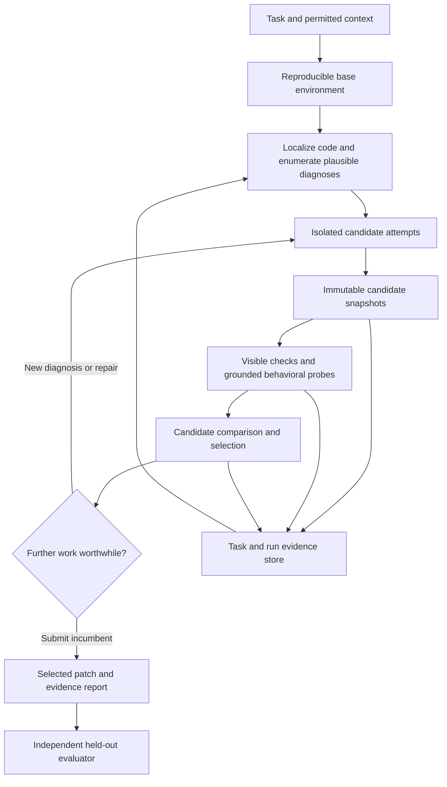

# ElevenPowers: a benchmark-first audit and replan

**The largest change I recommend is to make ElevenPowers responsible for finding and selecting better solutions, with evidence management as one component.** The current plan still organizes the project around a stop gate and gaps in competing frameworks. That is a reasonable scope for a verification plugin. It is too restrictive for the stated objective: maximum coding benchmark performance, even at higher cost.

There are also concrete defects beneath the conceptual oracle problem. I reproduced evidence surviving changed code, a deleted observed file still yielding `VERIFIED`, a failing latest run being superseded by an older pass, and an evaluator accepting a patch that breaks an existing test. The existing test suite nevertheless passes: **379 tests**. Before using this instrument to decide the next research direction, repair its measurement and evidence semantics.

My proposed order is: **trustworthy evaluation → strongest practical baseline → multiple candidate attempts → measured selection and repair → learned allocation of further work**. Keep the ledger, command capture and automatic verification, but use them throughout that process. Do not make all of this wait for the framework-composition milestone.

## Scope, evidence and what changed during this audit

The inspected revision is `9a21de12cc1de43e22896dbcc353d6927624643f`, with Plan v0.6. The audit covered the main runtime path, evidence and obligation logic, host adapter, repeat runner, evaluation/mining/replay/analysis code, tests, current plan and relevant research notes. External research was checked against primary papers, official project documentation and authors' engineering reports, accessed on 11 September 2026. This is not a fresh source audit of every upstream framework in the fourteen-system comparison.

I distinguish three kinds of finding:

- **Reproduced:** an isolated example executed against the current implementation.
- **Source finding:** a consequence of inspected code or a mismatch with a documented external contract, without a full live-host reproduction.
- **Proposal:** a design or research hypothesis that still needs an experiment.

No existing runtime, evaluator, tests, configuration or plan files were edited. A new [reproduce.py](E:/ElevenPowers/docs/research/audit_2026_09_11/reproduce.py) had already been created before the Markdown-only instruction; it is retained under your subsequent explicit exception. Its contents, sixteen observations, two additional checks and the test environment are recorded in [evidence-appendix.md](E:/ElevenPowers/docs/research/audit_2026_09_11/evidence-appendix.md). This report and that appendix are the subsequent additions.

The original mined instances, twelve candidate patches and run-level artifacts were unavailable in this checkout. I therefore did not independently reproduce the historical twelve-task result, the 36,034-command corpus measurement or historical costs. No paid agent runs were launched. The examples below establish failure modes, not their frequency in those historical runs.

## What is already in the plan, and is not a new recommendation

Plan v0.6 already distinguishes contract validity from implementation validity. It already proposes frozen issue-derived checks, differential preservation checks, interpretation probes, diagnostic testing of frozen candidates, matched-compute comparisons and fresh holdouts. Those are useful changes. I am not presenting them again as discoveries.

The additional findings concern the larger objective, the reliability of the evaluator and state machinery, the search process, model and context choices, and the ordering of research. They also change the interpretation of several claims in the current plan.

## Decisions I would make first

Here, P0 means a prerequisite for trusting research conclusions; P1 means the next performance investment. It does not mean every issue is a production emergency.

| Priority | Decision | Why it matters |
|---|---|---|
| P0 | Correct the external grader, retain every replicate and archive candidate artifacts | Otherwise an improvement or regression can be mismeasured or become impossible to investigate |
| P0 | Repair freshness, failure precedence and task/run identity | These are violations of the existing evidence contract, independent of the semantic oracle problem |
| P0 | Test the actual supported host protocol | Transcript replay currently synthesizes a shape that differs from current documented failure hooks |
| P1 | Replace the plugin-only mission with an outer search controller | Better stopping alone cannot explore a diagnosis or implementation the worker never considered |
| P1 | Establish strong pinned-model baselines and candidate pools | This separates weak generation from weak selection before building another verifier |
| P1 | Put localization and context construction on the performance path | Excluding code-finding because it is a crowded field optimizes novelty rather than task success |
| P1 | Replace the serial milestone chain with independent experimental tracks | Evaluation, search and oracle diagnostics currently wait on each other unnecessarily |
| P2 | Learn routing and reusable procedures from controlled training runs | Valuable after outcomes and candidate histories are trustworthy; premature before then |

## 1. The mission and backlog optimize the wrong objective

### 1.1 The project boundary rules out major performance levers

[PLAN.md:67](E:/ElevenPowers/PLAN.md:67) says the system never acts and does not own the loop. Automatic discharge already weakens the first statement. More importantly, the second excludes restarting an unproductive attempt, allocating another model, preserving alternative patches, choosing a winner and continuing from a better diagnosis.

For your stated objective, I would give ElevenPowers ownership of the **outer loop**. Existing coding hosts can still own the individual tool-use loop. This avoids an unnecessary rewrite of a terminal, editor or agent frontend while giving the project control over the decisions that can improve solved-task rate.

The deliverable then becomes: given a task, permitted repository context and a compute envelope, produce the strongest selected patch the system can find. The completion state describes evidence for that selected patch. It is one output of the system, rather than the system's organizing purpose.

### 1.2 A competitor-gap census should not govern investment

[PLAN.md:95](E:/ElevenPowers/PLAN.md:95) restricts justified architecture to the residual gaps in the comparison matrix. That is a novelty filter. A mature, widely implemented capability can still be the largest missing contributor to this project's performance.

Rank proposed work by the failure it addresses and the intervention that would test it. Relevant categories include environment setup, localization, requirement interpretation, implementation, cross-file integration, candidate selection and context loss. The matrix remains useful for choosing implementations to borrow after identifying a bottleneck.

Similarly, “the composition beats every part” is an empirical hypothesis, not a reason the product must exist. If a small controller around one strong worker wins, that is a successful result for your objective.

### 1.3 The milestone ordering contains a practical dependency cycle

The plan requires predecessors to exit before subsequent milestones start. M2 needs the discriminating suite assigned to M5; M2.5 and later work sit behind the unresolved M2 comparison. The plan partly acknowledges this exception, but the controlling rule still expresses the wrong dependency structure. See [PLAN.md:225](E:/ElevenPowers/PLAN.md:225) and [PLAN.md:253](E:/ElevenPowers/PLAN.md:253).

Use three tracks with explicit prerequisites: evaluation infrastructure, candidate generation, and candidate assessment. Oracle discrimination can proceed on frozen patches while the baseline harness is being made reproducible. Search experiments need a valid grader, not proof that a large plugin stack dilutes performance.

## 2. The evaluation can currently give the wrong answer

### E1. The real-task grader does not enforce preservation of existing tests

**Reproduced.** [eval/live.py:221](E:/ElevenPowers/eval/live.py:221) overlays hidden test files and invokes only `source["f2p"]`. There is no required PASS_TO_PASS set in the mined task schema. The synthetic grader likewise runs only its hidden file.

In an actual pytest subprocess experiment, the requested behavior passed, an existing test failed, and `_verify_real` returned `True`. This does not show that any of the historical five successes were regressions. It shows that the recorded success condition cannot establish regression-free resolution.

**Change:** evaluate each frozen candidate in a clean evaluator workspace using the benchmark's exact required FAIL_TO_PASS and PASS_TO_PASS sets and environment. For the homemade corpus, first validate base and maintainer-fix snapshots and explicitly construct the preservation set. Track setup failure, timeout and test failure separately. Confirm expected tests were collected and executed; a successful process exit alone is insufficient.

### E2. Repeated runs disappear in the analysis

**Reproduced.** [eval/analyse.py:25](E:/ElevenPowers/eval/analyse.py:25) stores one row per task and arm. A second run overwrites the first. Three input replicates produced one retained row. `eval.noise.outcomes` has the same overwrite pattern, although its separate calibration path does retain lists.

This makes `eval.live --runs N` incompatible with the main analysis's data model. Replicate costs, uncertainty and outcomes can be lost even when the input JSON contains them.

**Change:** use immutable run IDs and an explicit repeat index. Preserve all rows; define pairing before analysis. Report task-level outcomes and uncertainty that account for repeats of the same task. A hierarchical or task-clustered analysis is preferable to treating every repeated attempt as a new independent repository problem.

### E3. The evaluator deletes the evidence needed for the next experiment

**Source finding.** [eval/live.py:260](E:/ElevenPowers/eval/live.py:260) uses `TemporaryDirectory(dir=keep)`. The `keep` parameter selects a parent directory; it does not preserve the candidate. The context manager deletes the workspace. The `Run` record contains aggregate fields but no candidate diff, model revision, task digest, environment digest, test logs or trajectory.

This directly obstructs M2.5's requirement to freeze and re-examine the twelve candidate patches. A short narrative of a failure cannot substitute for the artifact that caused it.

**Change:** write a run bundle before cleanup: task manifest, base identity, candidate diff and snapshot ID, raw host events, prompts and model configuration, observable action trajectory, stdout/stderr references, test node outcomes, resource limits and final result. Keep evaluator-only artifacts outside worker access. Store references to large logs rather than embedding them in every model prompt.

### E4. Arms and environments are not sufficiently pinned

**Source findings.** `drive` uses a model alias; its process inherits the surrounding environment. Missing `EP_SUPERPOWERS_DIR` or `EP_STACK_DIR` silently omits the plugin even when the arm label says it is present. There is no explicit verification of the effective host settings or loaded component versions. Runs execute in fixed task/arm/repeat order. See [eval/live.py:47](E:/ElevenPowers/eval/live.py:47) and [eval/live.py:178](E:/ElevenPowers/eval/live.py:178).

**Change:** fail configuration validation when a requested arm cannot load. Record the resolved model and host versions, sampling settings, plugin hashes, effective instructions and environment. Randomize or interleave arm order. Use dedicated worker configuration and reproducible dependencies. Record CPU, RAM, wall time and timeout reasons as part of the treatment.

This is a performance issue as well as experimental hygiene. Anthropic's controlled infrastructure study found material score changes while holding the model and harness fixed, including roughly six percentage points across Terminal-Bench configurations. Its magnitude is not an estimate for ElevenPowers, but it makes environment control a serious competing investment. [Infrastructure-noise study](https://www.anthropic.com/engineering/infrastructure-noise).

### E5. The grader is separated in time, not isolated in authority

**Source finding.** Hidden files are introduced after the worker stops, but grading occurs inside its mutable workspace. Candidate changes to test configuration, import behavior, fixtures or runner hooks can affect grading. Removing Git history also leaves other answer channels uncontrolled when a worker retains broad host/network access.

There is no evidence from this audit that historical agents exploited these channels. The architectural issue is that a benchmark claim needs an evaluator whose inputs and execution are controlled independently of the candidate.

**Change:** export the candidate patch, apply it to a fresh evaluation environment, restore evaluator-owned assets and enforce the benchmark's permitted context and network policy. Legitimate configuration changes must be handled according to the task rules, rather than blanket-rejected. Reproducible evaluation requires more than hiding a test file until the end.

### E6. Several statistical and dataset rules need revision

The rule at [PLAN.md:363](E:/ElevenPowers/PLAN.md:363) selects tasks where the naive patch breaks the visible suite. That is a useful diagnostic stratum for a visible-test intervention, but it is not a definition of a valid coding task. PASS_TO_PASS means preserving specified behavior; it does not imply that every wrong fix breaks a visible test. Selecting the main benchmark around the gate's detection mechanism would favor the intervention being evaluated.

The 252-run requirement also needs to be recomputed for each intended comparison. The plan alternates between agent runs and paired runs. More fundamentally, the claim in `eval.noise` that within-baseline flip rate bounds treatment discordance is false: a baseline can fail deterministically and a treatment succeed deterministically, producing zero baseline flips and complete between-arm disagreement.

Additional changes:

- Use small mechanistic pilots to discover whether an intervention works at all; use a preregistered confirmatory comparison for general performance claims. Report effect sizes and intervals, not a universal significance gate for every iteration.
- Do not treat one failed attempt, or a few identical failures, as proof that a task is impossible. Conversely, preserve easier tasks in the held-out evaluation to measure regressions.
- Distinguish false blocks at a particular checkpoint from “the other arm solved this task.” To measure a block on an already-correct patch, freeze and independently grade the patch at the moment of that block.
- Do not use `claimed rate - resolved rate` as the primary performance objective. Algebraically it equals `P(claimed and wrong) - P(not claimed and correct)`. Report the complete joint table alongside resolved-task rate.
- Separate the closed benchmark track from interactive collaboration. Clarification can be useful in a real project, but an unanswered clarification does not improve a benchmark's selected-patch score.
- Preserve multiple repositories and failure categories. The click corpus is a valuable diagnostic collection; its small size and single-library focus do not establish broad coding-system performance.

The twelve-task null remains useful evidence about the tested configuration. These defects do not justify claiming that the gate secretly helped; they justify narrowing conclusions until the recorded outcomes and experiment can be reconstructed.

## 3. The evidence layer has soundness defects of its own

These are distinct from “the agent may misunderstand the issue.” Even perfect requirements would not prevent them.

### R1. Dirty-to-dirty changes can retain fresh evidence

**Reproduced.** [core/evidence.py:90](E:/ElevenPowers/core/evidence.py:90) hashes file size and modification time, not contents. When that signature changes, `freshness` can accept equality of `vcs_state`. But [vcs_state](E:/ElevenPowers/core/evidence.py:114) hashes HEAD and porcelain status text. Two different contents of an already-modified file can have the same status text.

The probe changed `value = 1` to `value = 999` after recording a pass. The stat signature changed, the VCS fingerprint remained equal, and the evidence was `fresh`. This is an ordinary edit sequence, not timestamp manipulation.

### R2. Additions and dependency changes escape the observed set

**Reproduced for a new test file; source finding for the broader exclusions.** Freshness recomputes the previously stored list of paths. Adding a failing `tests/test_new.py` did not stale an earlier record. The source enumerator also excludes hidden directories and several meaningful input types, and silently stops at 20,000 files. Environment, installed dependency and command-definition changes are not part of the fingerprint. See [core/evidence.py:155](E:/ElevenPowers/core/evidence.py:155).

The current scheme is therefore not conservatively coarse. Some changes are over-invalidated, while other relevant changes are missed.

### R3. A missing observed file can still produce `VERIFIED`

**Reproduced.** Deletion produced `Freshness.GONE`, but [core/ledger.py:215](E:/ElevenPowers/core/ledger.py:215) rejects only `Freshness.STALE` when all checks are otherwise met. The final verdict was `VERIFIED`.

**Change for R1–R3:** make evidence refer to an immutable input snapshot or a manifest of actual content digests, including directory membership and relevant runner/configuration/dependency inputs. Use a cached digest tree to control overhead. Metadata can accelerate rehashing; porcelain status cannot certify unchanged bytes. A missing input must invalidate dependent evidence.

Bind the record to what the command actually ran against. Capturing the tree only after completion is unsafe for a shell command that runs tests and then edits files, or for tests running concurrently with an edit. A practical first step is isolated verification snapshots plus pre/post input checks. Precise static test-impact analysis can follow; it does not repair an unsound fingerprint underneath it.

### R4. Older passes and equal failure counts can conceal current breakage

**Reproduced.** A fail → pass → fail history returned `VERIFIED`. `satisfied_by` selects among passing records; `_contradictions` exempts an identity when its first observation failed. The old pass can consequently satisfy the obligation while the latest failure is treated as pre-existing.

Separately, changing from one failing test to a different failing test, with the same total count, satisfied “no new failures.” [_no_new_failures](E:/ElevenPowers/core/ledger.py:370) compares counts, not identities. First observation is also not necessarily a pre-edit baseline. Broad matching can compare unlike suite invocations.

**Change:** capture an explicit baseline on the original snapshot. Compare required test identities under the same command, scope and environment. Evaluate the latest applicable outcome before selecting satisfying evidence. Preserve a distinction between expected base failures, repaired targets, new regressions and infrastructure failures. A stable count is not evidence of preserved behavior.

### R5. A non-test command can discharge a suite obligation

**Reproduced.** `echo pytest` and `python -m pytest --version` each produced passing suite evidence with zero recorded tests and yielded `VERIFIED` for the fixture's refactoring claim. [core/parsers.py:180](E:/ElevenPowers/core/parsers.py:180) recognizes the substring, and the suite record trusts the process exit status.

Command identities are also lossy: [_scope](E:/ElevenPowers/core/parsers.py:229) drops flags and chooses a short token-derived target. Different selectors, working directories and wrappers can collapse together. Shell pipelines and compound commands need explicit treatment because the final process exit may not represent the test invocation.

**Change:** separate “recognized command text,” “process completed,” “test execution observed” and “required test target passed.” Prefer runner-owned structured result artifacts and normalized invocation records for the authoritative path. Keep heuristic parsing for broad observation, with an explicit confidence/coverage status. A declared wrapper can be supported without pretending every occurrence of a runner's name proves tests ran.

### R6. Reading an existing test is treated as writing a covering test

**Reproduced.** [_test_written_and_suite_green](E:/ElevenPowers/core/ledger.py:343) searches `touched ∪ seen`. The fixture read an existing test, touched nothing, then supplied a green suite. The bug-fix verdict was verified with a caveat saying a test had been written.

**Change:** record edits separately from reads and connect executed test nodes to the particular invocation. Report what the evidence supports: an existing test passed, a test changed, or a behavior was exercised. Merely identifying a scoped test does not establish coverage of the changed requirement either. Do not solve nuisance blocking by upgrading weaker evidence into a stronger claim.

### R7. State is shared across tasks and can lose concurrent updates

**Reproduced.** A new implementation request retained the previous task ID, evidence, read paths and `guided` flag. [on_prompt](E:/ElevenPowers/core/hook.py:88) reuses the task identifier and does not create a clean task boundary.

Two independently loaded ledgers, each appending a different event, then saving, retained only the second event. [Ledger.save](E:/ElevenPowers/core/ledger.py:131) uses atomic replacement, which prevents a partially written JSON file but does not make read-modify-write transactional. The shared temporary filename is another concurrency risk.

**Change:** use separate task, session, worker, candidate, snapshot and invocation IDs. Store events transactionally, with idempotent host-event IDs and explicit task transitions. Reuse old evidence only through snapshot/command compatibility, not because it happens to remain in the same working-directory ledger. SQLite with transactions is a reasonable initial implementation; a distributed event platform is unnecessary.

### R8. Risk and self-discharge do not track subsequent edits correctly

**Reproduced.** With an existing claim, `observe_edit` returns before updating `touched` and risk. A later edit under `src/auth/` left the fixture at low risk. The Stop path refreshes touched paths but not risk. See [core/ledger.py:161](E:/ElevenPowers/core/ledger.py:161).

A genuinely stale passing check also yielded no auto-discharge command, despite a declared test command. [dischargeable](E:/ElevenPowers/core/verify.py:30) schedules unmet checks, whereas stale checks can remain `met=True`.

**Change:** recompute applicable obligations after relevant edits and task-state transitions. Treat absent, stale and invalid evidence as different reasons verification needs work. Then coalesce duplicate verification requests for the same snapshot and invocation.

### R9. Repetition can certify the wrong target and overstate confidence

**Reproduced.** [_check_stability](E:/ElevenPowers/core/ledger.py:317) accepted clean repeats of an unrelated `python -c pass` command for a flaky-test obligation. The baseline failure rate can also come from another repeated command.

[runs_needed](E:/ElevenPowers/core/repeat.py:66) caps repetitions at 300. For a 0.1% failure rate, the uncapped count needed for a 5% probability of observing zero failures is 2,995. Three hundred clean runs still have approximately **74.1%** probability under that unchanged failure rate. The same 300 clean runs exclude only rates of about 0.994% or greater under the simple independent-trial model.

**Change:** bind baseline and follow-up repetitions to the same target, environment and sampling protocol. When a budget cap prevents the desired confidence, report insufficient evidence; do not silently lower the sample size while retaining the claim. Account for uncertainty in the estimated baseline rate and for dependent repetitions. Repetition is a statistical test under assumptions, not a proof that an intermittent bug is gone.

## 4. Current host compatibility needs a separate integration test

**Documented-contract mismatch, with a parser/handler reproduction.** Current Claude Code documentation places failure information in top-level `error` fields. [read_result](E:/ElevenPowers/core/payload.py:61) looks only under three nested result keys. A fixture using the documented failure shape produced `readable=False`, zero captured evidence and handler exit 0. [Call.payload](E:/ElevenPowers/eval/transcript.py:38) instead manufactures a nested `tool_result` from a transcript. Replay accuracy therefore does not establish actual hook-input compatibility. Historical host versions were not reconstructed here. [Official failure-hook contract](https://code.claude.com/docs/en/hooks#posttoolusefailure-input).

Two further compatibility risks follow from the current contract. Stop `additionalContext` continues the conversation, yet verified/report-only branches emit it. All generated hooks have a 20-second timeout while automatic verification allows 300 seconds; timed-out hooks lose their output and usually make no decision. PowerShell commands are also absent from the Bash-only subscription. These need pinned-host end-to-end tests; their live frequency was not measured. [Official hooks reference](https://code.claude.com/docs/en/hooks).

**Change:** keep raw webhook fixtures separate from transcript fixtures. Test subscription, invocation, payload, output interpretation and stop behavior together. Include successful commands, failures, interrupts, parallel calls, long tests and every supported shell. Report installed compatibility explicitly. Run long verification outside the short-lived hook callback, with snapshot-bound job state and a controlled resume path. Avoid emitting continuation feedback merely to display a final status.

This finding narrows the headline “174/174 failures”: it may be a correct replay result, but it is not sufficient evidence that all live failures reach the ledger.

## 5. The architecture I would build toward

This is a proposal for experiments and implementation after the P0 repairs. It is not a claim of demonstrated gains in ElevenPowers.

The held-out evaluator is used for development measurement or final benchmark scoring. Its answers are unavailable to the worker, runtime selector and within-task repair policy. Training tasks can provide supervised outcomes under a separate protocol.

### 5.1 Measure the generation ceiling before designing a better examiner

For a frozen pool of N candidate patches, measure two quantities offline:

- **Pool coverage:** fraction of tasks for which at least one candidate is correct under the external evaluator.
- **Selected success:** fraction for which the runtime's chosen candidate is correct.

The difference is selection regret for that pool. Pool coverage is an oracle upper bound, not the system's achieved benchmark score.

If every candidate is wrong, reranking that pool cannot fix the task. Invest in localization, models, diagnosis diversity or new repair attempts. If the pool contains correct solutions that are rejected or overlooked, improve selection. If refinement creates correct patches absent from the initial pool, preserve that mechanism separately from reranking gains.

This decomposition is more actionable than another gate-on/gate-off result. Use N=1, 4 and 8 as initial experimental settings, then choose larger budgets from the observed performance curve. These are pilot settings, not statistically justified sample sizes.

### 5.2 Branch at diagnosis, not just at patch generation

Multiple workers prompted with the same interpretation can reproduce the same mistake. Create alternatives at the decision that constrains the eventual patch: formatting rule versus shared type behavior, ownership versus cleanup timing, local workaround versus common implementation.

Share verified repository facts and the permitted task statement. Keep speculative diagnoses separate until comparison. Measure diversity through observed failure overlap and solutions found, not differences in role names or prose.

A useful new module would propose a **missing-code search** after a candidate edit: inspect sibling implementations of the changed interface, callers with different argument types, exception paths, resource ownership transitions and serializers/parsers that must agree. This extends the existing interpretation-probe plan by targeting incomplete localization and cross-file integration. It should retrieve concrete code and produce bounded follow-up actions, rather than demand a generic comprehensive review.

### 5.3 Make context a constructed working set

[PLAN.md:340](E:/ElevenPowers/PLAN.md:340) explicitly excludes finding code from the repository model. I would remove that restriction. Reuse existing symbol search, call relationships and repository maps where they help the worker identify the right code. Use dynamic traces and test execution when static relationships are unreliable.

The worker's compact state should contain the task contract, current diagnosis, located symbols, observed failures, rejected approaches, active candidate, unresolved questions and exact evidence references. Code and long logs remain retrievable. Summaries must distinguish observations from hypotheses so a mistaken interpretation is not promoted into an established fact during compaction.

Do not make a giant always-loaded repository overview the default. The revised AGENTS.md study reports that generated and developer-provided context files generally did not improve success while increasing cost; useful nonstandard instructions are a narrower category. That revises the stronger developer-file benefit suggested by the local reading list's older secondary summary. [Evaluating AGENTS.md, v2](https://arxiv.org/html/2602.11988v2).

### 5.4 Use summaries for selection, then inspect primary evidence

Store a bounded candidate summary with:

- diagnosis and affected symbols;
- candidate snapshot and patch reference;
- changes made and compatibility assumptions;
- actual checks run, failures and unresolved observations;
- provenance of expectations and whether they are authoritative or inferred.

A selector can compare small candidate groups, request original code/logs and inspect behavioral differences. Randomize presentation order when assessing judge bias. Measure rejection of correct candidates and selection regret, not just judge agreement.

There is direct research support for exploring this direction. Kim and colleagues combine structured rollout summaries, Recursive Tournament Voting and Parallel-Distill-Refine; their reported Claude-4.5-Opus results improve from 70.9% to 77.6% on SWE-Bench Verified and 46.9% to 59.1% on Terminal-Bench v2.0. Those results use substantial additional inference and specific older model/harness combinations. They support an experiment, not an expected uplift here. [Scaling Test-Time Compute for Agentic Coding](https://arxiv.org/html/2604.16529v1).

A stronger examiner is therefore not the only remaining opportunity. Better generation, comparison and reuse can improve selected correctness even when none of the components is an infallible oracle.

### 5.5 Treat generated checks as uncertain until grounded

The new independent-check plan should retain a distinction between mandatory checks backed by authorized requirements and speculative checks generated to investigate behavior. Freezing a wrong assertion before seeing a patch does not make it correct.

This becomes more consequential with multiple candidates and multiple check generators. Adding checks can increase the chance that at least one correct candidate is falsely rejected. Measure **correct-candidate survival through each filter**, and retain rejected candidates for offline analysis. A speculative discrepancy should often launch investigation or reduce a ranking score; it should not automatically remove every candidate that disagrees with it.

A useful experiment is a candidate-by-probe outcome matrix. Look for inputs where plausible candidates disagree, then retrieve the contract or nearby code that could explain the disagreement. The matrix is an instrument for selecting the next investigation. Voting across candidates is not an authority on intended behavior.

### 5.6 Preserve an incumbent while allowing nonmonotonic search

A long attempt often leaves the workspace at its latest patch, which need not be its strongest patch. Maintain immutable candidates and an incumbent chosen by the current selection policy. A failed repair should not destroy an earlier candidate's code or evidence.

The incumbent is not guaranteed correct; it is the best selected option under available observations. After branch integration or cherry-picking, create a new snapshot and rerun applicable checks. Evidence from two independently passing branches does not automatically apply to their combined patch.

### 5.7 Route for complementary capabilities, not only lower prices

Model routing is postponed until cost becomes a complaint in [PLAN.md:501](E:/ElevenPowers/PLAN.md:501). Under your objective, an earlier question is whether different model/harness configurations solve different tasks. Start with strong pinned configurations and measure their overlap. Benchmark the host's native strengths before assuming additional scaffolding improves them.

The mini-SWE-agent project's model-mixing experiment found complementary benefits in some combinations and no improvement in another. It is an illustrative older experiment, not a prescription for today's exact models. [Roulette-mode experiment](https://www.swebench.com/post-250820-mini-roulette.html).

Use independent workers for bounded alternative diagnoses or implementations. Centralize state, evaluation and integration. Do not assume a committee helps every sequential task: broader multi-agent research finds strong dependence on task structure and coordination, though those experiments are not direct coding-benchmark effect estimates. [Towards a Science of Scaling Agent Systems](https://arxiv.org/abs/2512.08296).

### 5.8 Learn from decisions, not merely from successful transcripts

Begin with per-task working memory and structured attempt histories. They immediately support selection and recovery. A general cross-project memory system can wait.

Later, train the policy that chooses the next action: inspect another caller, execute a diagnostic input, launch a fresh attempt, repair the incumbent or stop. Save the conditions under which the action was chosen and its subsequent outcomes. Fixed-transcript replay can validate parsers and retrieval mechanics; it cannot establish the causal benefit of a different prompt, routing decision or intervention whose downstream actions were never executed.

Prompt/procedure optimization is worth testing after this data exists. GEPA offers a concrete approach using execution feedback and reflective prompt evolution, but its results do not demonstrate that optimizing this controller will improve repository-level patch selection. Keep training, development selection and final evaluation separate. [GEPA](https://arxiv.org/abs/2507.19457).

## 6. Research updates that should change the reading list

| Primary source | What I would take from it | Limit on the inference |
|---|---|---|
| [mini-SWE-agent documentation](https://mini-swe-agent.com/latest/) | Include a small, current, reproducible worker harness as a baseline | Simplicity is a useful comparison, not proof that custom tools never help |
| [SWE-agent: Agent-Computer Interfaces Enable Automated Software Engineering](https://arxiv.org/abs/2405.15793) | The interface offered to a model is itself an experimental variable | Its historical model scores are not today's ceiling |
| [SWE-Search](https://arxiv.org/abs/2410.20285) | Search over alternative actions and trajectories is an established coding-agent direction | Do not implement a full search tree before a simpler candidate-pool baseline demonstrates remaining headroom |
| [Effective context engineering for AI agents](https://www.anthropic.com/engineering/effective-context-engineering-for-ai-agents) | Use targeted retrieval, compact working state and recoverable references | Engineering guidance, not a measured ElevenPowers intervention |
| [SWE-smith](https://arxiv.org/abs/2504.21798) | Large executable task/trajectory datasets provide a route to training a specialized worker later | Synthetic task generation is not independent evaluation; training is a later investment |
| [Proof-or-Stop](https://arxiv.org/html/2607.14890v1) | Keep the claim/evidence/gate precedent and its narrowly measured fault-detection results | Its injected-fault, single-family design does not calibrate the natural failure rate or power requirement of this coding experiment |
| [OpenAI's July 2026 coding-evaluation audit](https://openai.com/index/separating-signal-from-noise-coding-evaluations/) | Reconsider treating SWE-bench Pro public as an unquestioned primary instrument; the authors report substantial task/test defects and withdrew an earlier recommendation | A vendor's audit is evidence to inspect and version, not a reason to discard inconvenient benchmark outcomes |
| [SWE-Bench Pro Verified](https://arxiv.org/html/2609.08149v1) | Investigate the proposed task refinements and protections against answer leakage, including channels beyond local history | A very recent preprint, first posted 8 September 2026; independently validate the chosen release before adopting it |

The correct response to benchmark defects is a versioned portfolio: a clearly specified external benchmark track, a frozen private development corpus spanning repositories and failure modes, and a final holdout untouched by prompt or policy tuning. Publish the task accounting, excluded-instance reasons and result for each track. Do not repeatedly rebuild the main test set until the preferred mechanism wins.

## 7. A replacement execution order

### Phase A: make conclusions reconstructible

Repair E1–E5 and the reproduced evidence semantics before making new performance claims. Add actual host-event fixtures and a small host-level smoke test. Introduce run manifests, immutable candidate artifacts and a protected evaluator workspace. Provision a suitable isolated Linux/container worker for external benchmarks; local lack of Docker should not determine the scientific scope of the project.

**Exit:** a run can be reconstructed from its bundle; a known regression fails grading; no replicate is lost; candidate input changes invalidate dependent evidence; and supported host success/failure/stop paths have been observed end to end. This phase should have narrow regression tests for the reported counterexamples, not another large synthetic benchmark claiming coding competence.

### Phase B: establish the strongest useful baseline

Compare a current strong native coding-host configuration with a minimal worker harness under pinned models and environments. Measure a modest, preregistered pilot spanning several repositories and difficulty categories. Keep a separate untouched evaluation set. Measure effective loaded instructions rather than counting installed skills.

Run both a controlled compute comparison and a maximum-performance budget curve. Since cost is secondary for you, the latter is the primary product direction; the former explains where gains came from.

**Exit:** at least one reproducible baseline, a failure taxonomy supported by saved trajectories, and enough repeated observations to distinguish setup problems from coding failures. No universal 252-run threshold is imposed on this diagnostic stage.

### Phase C: separate generation from selection

Generate candidate pools at several budgets. Grade the pools offline, then evaluate runtime selectors without exposing hidden outcomes. Compare selection using patch text, structured summaries plus evidence, and the existing gate. Run the already-planned A/B/C oracle diagnostics independently on frozen candidates.

**Exit:** pool coverage, selected success, selection regret, false rejection, regression rate and total compute are reported together on development and untouched tasks. If the pool never contains correct solutions for a failure category, route investment toward generation rather than polishing the selector.

### Phase D: spend more compute where it creates new solutions

Test diagnosis branching, missing-code searches, complementary worker configurations and fresh-context repair from evidence-linked summaries. Preserve candidate snapshots and an incumbent. Compare each addition against ordinary extra independent attempts at a matched budget.

**Exit:** a selected-patch gain survives a preregistered held-out comparison and is not explained by scoring defects or excluded tasks. A component can be dropped even if its local reviewer score improves.

### Phase E: learn the allocation policy

Only then optimize routing, prompts and reusable procedures on training/development tasks. Consider worker training if a reliable task and trajectory pipeline is now the limiting asset. Keep cross-project memory evidence-backed and separately evaluated.

**Exit:** improvement transfers to unseen tasks or repositories under the declared evaluation distribution. Replay-only improvements are not counted as solved-task gains.

## 8. The experiments I would actually run next

These are proposals; none was executed as part of this audit.

| Experiment | Main comparison | Decision it answers |
|---|---|---|
| Instrument validation | Gold patch, known regression, wrong patch, setup failure | Can the evaluator distinguish the required outcomes? |
| Strong baseline | Native host versus minimal harness, pinned model/configuration | Are we starting from a competitive worker? |
| Candidate scaling | N=1/4/8, selected score and oracle pool coverage | Is more generation buying useful alternatives? |
| Selection ablation | Patch-only versus summaries plus referenced execution evidence | Does the representation improve the chosen patch? |
| Diagnosis diversity | Same worker retries versus different grounded diagnoses | Are workers escaping shared mistakes? |
| Localization expansion | Normal context versus targeted caller/sibling/ownership search | Are failures caused by missing relevant code? |
| Repair versus restart | Continue transcript versus fresh worker with structured prior facts | Does context reuse preserve learning without preserving fixation? |
| Check survival | Required checks alone versus added generated checks | Do new tests eliminate wrong candidates without eliminating correct ones? |
| Complementarity | Repeated strongest worker versus a measured heterogeneous pool | Does configuration diversity add solutions? |
| Gate contribution | Same search pipeline with capture-only, automatic checks and blocking | What marginal value does blocking add after search exists? |

Use total inference, judge calls, external test time and infrastructure resources in the accounting. The original 1.4× gate comparison remains relevant to that narrow configuration; it is not an argument against spending substantially more compute through a mechanism that demonstrably creates or selects more correct patches.

## 9. Things I would retain, defer and stop claiming

**Retain:** automatic collection from ordinary work, automatic execution of declared checks, explicit provenance, honest unresolved states, independent oracle diagnostics, and a visible history of failed research hypotheses. These are useful foundations.

**Defer:** a second host adapter, a large always-on framework stack, broad cross-project memory, a custom tree-search framework, elaborate risk routing, and precise static test-impact optimization. Bring them forward only when the new measurements identify their bottleneck. Correct invalidation itself is not deferred.

**Revise these claims before repeating them:**

- “Evidence is bound to exact file contents”: not true of the present implementation.
- “The instrument is honest”: separate parser fidelity, host delivery, freshness, evaluator validity and statistical analysis; none proves all the others.
- “The first failing observation was pre-existing”: it is not a baseline unless measured before the relevant changes.
- “No more failures means no new failures”: failure identities and execution conditions matter.
- “Real commits remove the population problem”: they improve authenticity but do not remove sampling bias, underspecification or grader defects.
- “Existing-suite failure is necessary for a useful task”: that defines a mechanism-specific diagnostic subset, not coding correctness.
- “The evidence layer must itself decide done, or the project has failed”: the layer can be valuable within a stronger search-and-selection system without being an independent semantic oracle.

The most promising distinctive investment is an evidence store that makes **alternative solutions comparable and failed attempts reusable**. At present, the ledger mainly explains why one attempt may stop. Evolving it to support choosing what to try next gives the project a much larger route to better coding performance, while retaining the part of the original idea that is worth keeping.
