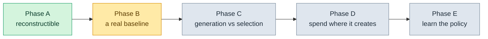

# Roadmap

[← What's Offered](README.md)

Five phases, each with an exit criterion written as a **command** rather than a feeling, and a spending envelope written before anything is measured.

The rule this plan is followed by: take the next unmet exit criterion, and within a phase take the cheapest experiment that could falsify the thing being claimed. If a phase exceeds its envelope without reaching its stop condition, **that is a result about the design, not a reason to spend more.**

The authority is [`PLAN.md`](../PLAN.md) §7. This page is the readable version.

---

## Where we are

---

## Phase A — Make conclusions reconstructible · **closed 2026-09-12**

Nothing could be believed until the instrument could be trusted, so this phase fixed the instrument rather than building anything new.

All twenty audit defects fixed. Run bundles added, so a run survives the workspace it happened in. Grading moved into an evaluator-owned workspace from an exported patch. Every exit criterion passing as a command.

**Total live spend: $0.72 against a $5 envelope.**

The first live sweep after the repairs failed all four runs, and failed *usefully*: the exported candidate was mostly compiled bytecode because the seeded workspace had no ignore rules, `git apply` rejected it, and the harness correctly recorded `setup` instead of counting four failures against the agent. The bundles made it diagnosable from a workspace that no longer existed. Both of those are the point of the phase, demonstrated by accident on its first outing.

---

## Phase B — Establish the strongest useful baseline · **in progress**

You cannot claim an improvement without knowing what you are improving on. This phase builds a real baseline: pinned models, pinned environments, several repositories, difficulty as a label rather than a filter.

**Envelope: $20–40. Stop condition: a reproducible score with an interval.**

| | |
|---|---|
| **B1 — a pinned corpus** | done. Fifteen instances from five repositories, locked and rebuildable |
| **B2/B3 — a pinned score and a taxonomy** | done. A score that refuses to run unpinned, an interval computed over tasks rather than runs, and a failure taxonomy whose every category can be opened to the trajectories behind it |
| **B4 — the first sweep allowed to cost money** | run. Ninety unattended paid runs, two passes, $67.42 against the $20–40 envelope |

### What B4 actually established

Reported as states rather than a pass mark, which is the house style:

| Claim | State |
|---|---|
| the harness survives ninety unattended paid runs | **verified** — nothing broke, nothing needed a human |
| the grade is a function of the base and the patch | **contradicted twice in one night** — first by the grader's Git configuration, then by what an unrelated agent installed on the machine mid-run |
| a rerun reproduces | **verified, weakly** — 68.9 and 73.3, and the criterion is met mostly because a 42-point interval is hard to miss |
| a grade survives being re-taken from the bundle | **verified** |
| the taxonomy describes real runs | **verified for three of ten categories**; seven have still never been seen |
| **P1, the hypothesis this project exists to test** | **unverified, and not addressed by this run at all** — one arm was measured, not two |

Three claims from the write-up were withdrawn afterwards when the contamination was traced. The overspend and the withdrawals are both on the record; see [journey/23-spend.md](../journey/23-spend.md).

> [!NOTE]
> The line to keep from B4: *the verification that was supposed to prevent a bad measurement looked exactly like success.* Roughly a dollar of the $67.42 went on the two runs that caught a line-ending defect, which is the cheapest thing that happened that night — ninety runs that silently filed every solved task under "harness breakage" would have been worth less than nothing, because they would have carried a pinned corpus, a pinned model, an interval and a reproduction, and been wrong.

---

## Phase C — Separate generation from selection · **next**

The first phase that tests the actual idea. Generate pools of candidate patches at several budgets, grade them offline, and evaluate *selectors* without letting them peek at hidden outcomes — patch text, structured summaries plus evidence, and the existing gate, compared against each other.

**Envelope: $40–80, pools at N = 1, 4, 8.**

**Exit, as a command:** `python -m eval.pool --n 1,4,8` reports pool coverage, selected success, selection regret, correct-candidate survival, regression rate and total compute together, on development tasks and on untouched ones.

This is where the evidence layer finally gets asked the question it was rebuilt for: **can it tell a good candidate from a bad one better than reading the patch can?**

---

## Phase D — Spend compute where it creates new solutions

Diagnosis branching, missing-code search, complementary worker configurations, fresh-context repair from evidence-linked summaries. Each compared against the honest control: simply making more independent attempts at the same budget.

**Envelope: $80+, decided by Phase C's curve.**

**Exit:** a selected-patch gain that survives a **preregistered** held-out comparison and is not explained away by scoring defects or excluded tasks.

---

## Phase E — Learn the allocation policy

Routing, prompts and reusable procedures learned from training and development tasks. Cross-project memory only if it is evidence-backed and separately evaluated.

**Not budgeted until Phase D returns something.**

**Exit:** improvement transfers to unseen tasks or repositories. Replay-only improvements do not count.

---

## What would falsify this whole direction

Written down in advance, which is the only time it is worth writing down:

- **Pool coverage barely exceeds selected success.** Then selection is not the bottleneck and the search framing buys little.
- **Candidate scaling flattens immediately.** More attempts produce the same wrong answer, and the investment belongs in generation quality or localisation instead.
- **Every oracle diagnostic accepts the candidate and the maintainer's fix equally.** Then the assessment track cannot discriminate, and the honest product is capture and reporting — not a gate.
- **The strong baseline is already at the ceiling of the corpus.** Then the corpus is exhausted, not the idea, and the portfolio needs harder tasks.

---

## Deliberately not built

Postponement here is a decision with a condition, not a quiet drop. Nothing below gets built until its trigger fires, and every trigger is a measurement rather than an opinion.

| Subsystem | Trigger |
|---|---|
| **Repository model** (static test-impact analysis) | the measured rate of "one edit stales everything" becomes annoying in daily use. Then narrow `observed` to each test's import closure |
| **Dynamic invalidation from coverage** | static import closure proves too coarse on a real codebase |
| **Workflow compiler** | dogfooding shows the agent failing to sequence work toward obligations it clearly understands |
| **Context engine with per-stage budgets** | large-repository tasks fail on context — measured, not assumed |
| **Memory across sessions** | multi-session use shows the same fact re-derived three times. Note that both field systems with real memory code report automatic capture failing to produce useful records |
| **Model routing** | cost becomes a real complaint. The host already selects models per subagent |
| **Critics and subagents** | regression rate on risky changes stays high with the gate on |
| **Second host adapter** | someone asks, or the numbers justify porting. Codex first — its hook engine is the closest match to Claude Code's |
| **Browser evidence** | a UI claim type is needed. gstack's Playwright daemon is MIT and liftable |

Full list with the reasoning: [`docs/postponed.md`](../docs/postponed.md).

---

## How you can move this

The triggers above are measurements, and most of them are measurements **of use**. "This stales everything constantly on my 4,000-file repository" is not a complaint, it is the data that starts the repository-model work. "I want this on Codex" is the trigger for the second host adapter, verbatim.

So if something here is annoying you, that is useful: **[satyambcnrk@gmail.com](mailto:satyambcnrk@gmail.com)**.
